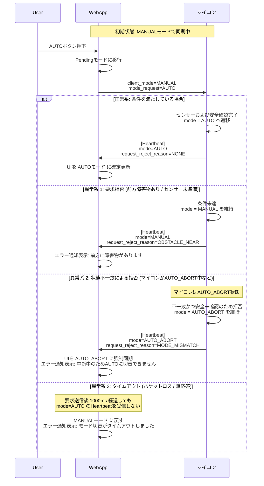
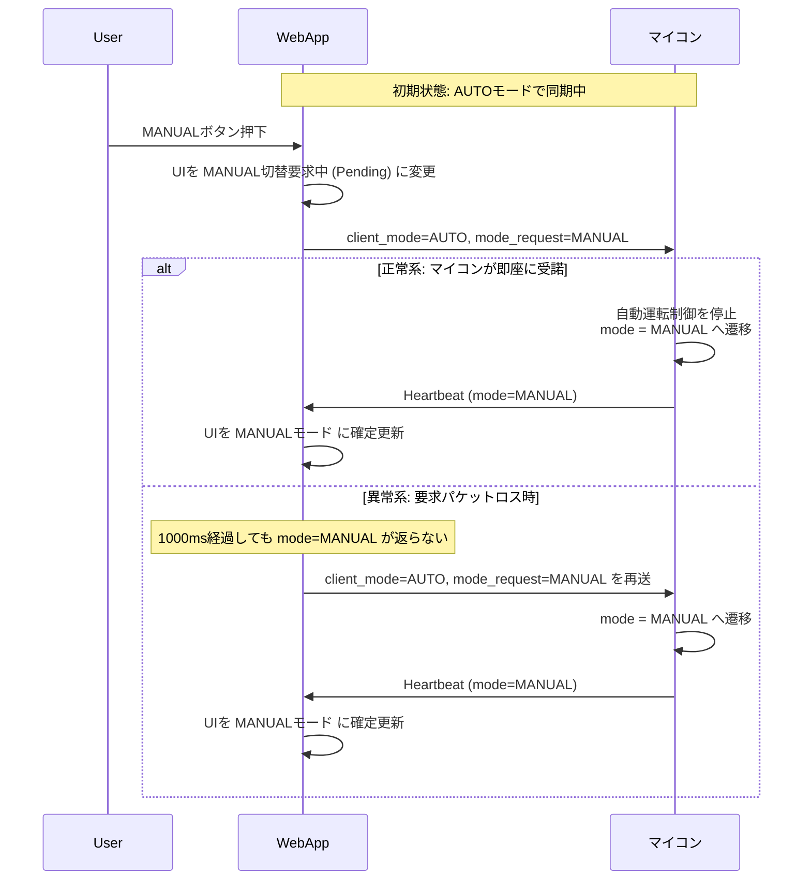
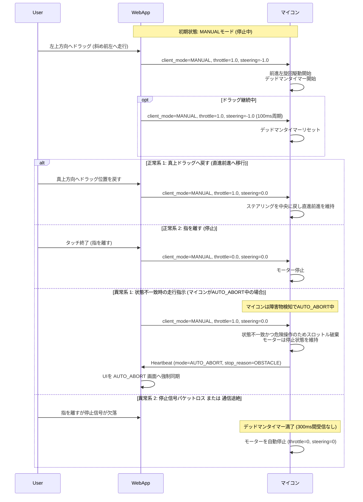
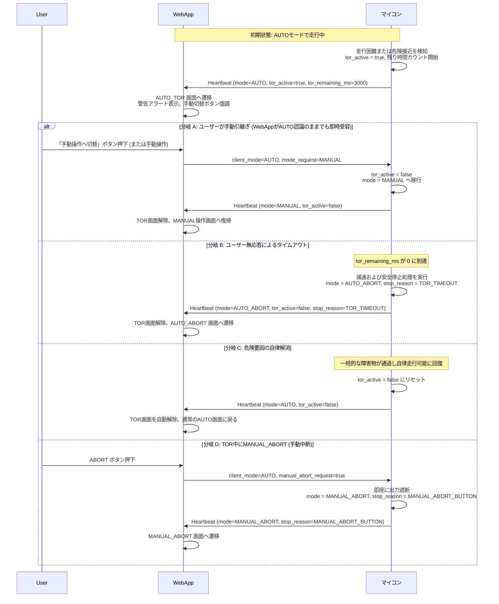
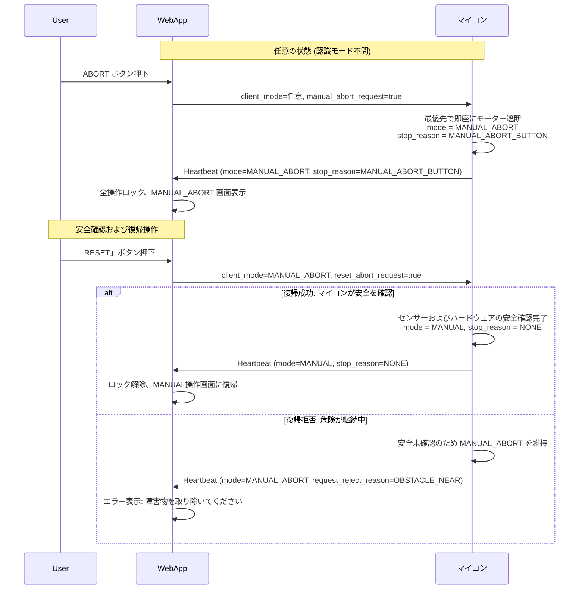
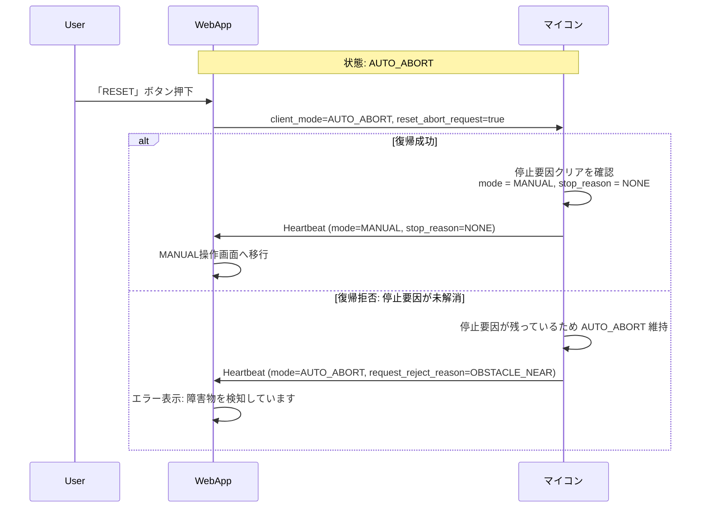
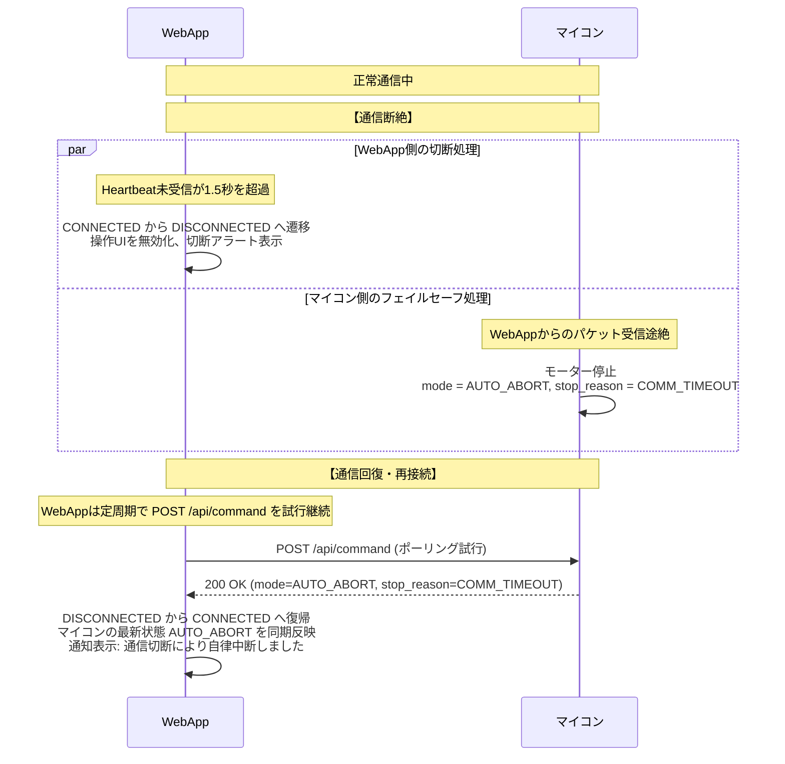

# 状態遷移・シーケンス図集

本ドキュメントでは、WebApp と 車載マイコン間の対話フローを、正常系・異常系・フェイルセーフの各シナリオにおけるシーケンス図として示します。

> [!NOTE]
> WebApp と 車載マイコン間の制御・状態同期は、100ms周期の **HTTP Keep-Alive 永続接続ポーリング (`POST /api/command`)** により行われます。
> WebAppが送信するリクエストボディに操作コマンドが含まれ、マイコンからのレスポンスボディ (200 OK) に最新テレメトリ (Heartbeat相当) が含まれます。
> 以下のシーケンス図では、理解を容易にするため「WebAppからのコマンド送信（リクエスト）」と「マイコンからの状態返信（レスポンス）」として対話を描いています。

## 1. モード切替: MANUAL → AUTO

WebAppからAUTO要求を出した際、マイコンの状態判定により分岐します。

## 2. モード切替: AUTO → MANUAL

手動運転への復帰は安全確保のため、マイコン側で最優先で即時受諾されます。

## 3. MANUALモードの方向操作と通信途絶（2軸仮想ジョイスティック・斜め走行）

## 4. TOR（Take Over Request）のライフサイクル

AUTO走行中、マイコンが自律走行困難を検知した際のシナリオ（障害物接近、白線ロスト、センサー信頼性低下など）。

## 5. MANUAL_ABORT (手動中断) の発報と復帰手順

## 6. AUTO_ABORT (自動中断) からの復帰シーケンス

## 7. 通信切断と再接続

