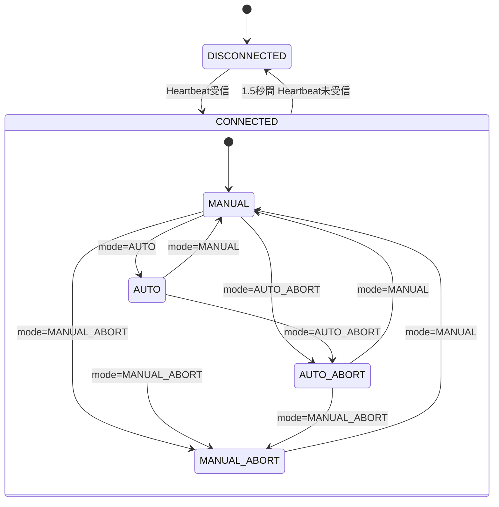
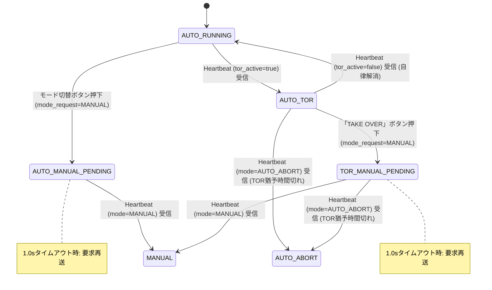
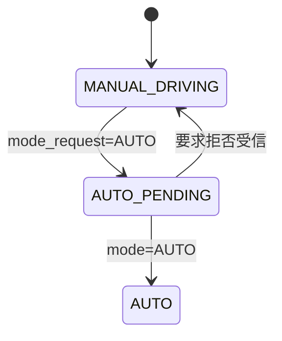

# WebApp UI仕様・画面遷移設計書

本ドキュメントでは、ミニ四駆自動運転 WebAppの画面構成、UI状態遷移、モバイル操作入力仕様、および各モードにおける操作可否マトリクスについて定義します。

## 1. UI画面状態遷移図

WebAppはマイコンからのHeartbeatを監視し、現在のモードおよび通信状態に応じてUI状態を遷移させます。

### 1.1 全体UIモード状態遷移図

マイコンの確定モード（`mode`）および通信状態に基づく全体の基本遷移です。

### 1.2 AUTOモード状態遷移図

`AUTO` モード中における自律走行、TOR（運転引継ぎ要求）、および手動復帰 Pending 状態の詳細フローです。

### 1.3 MANUALモード状態遷移図

`MANUAL` モードから `AUTO` への切替要求中（Pending）とタイムアウト・拒否時のフローです。

1.0秒で応答がない場合、WebAppは待機中のAUTO要求を解除してタイムアウトを表示します。MANUAL要求は自動生成せず、遅れて届いたM33状態に画面を合わせます。

## 2. 各モードにおけるUI表示・操作可否マトリクス

### 操作可否一覧表

| 親モード | UI状態 | スロットル / ステアリング | モード切替ボタン | ABORT / RESET ボタン | 画面表示・アラート |
|---|---|---|---|---|---|
| **MANUAL** | **MANUAL (通常手動)** | **前進・旋回のみ有効**（後退は未提供） | 有効（表示: `MANUAL MODE` / 押下で `AUTO` 要求） | **有効**（「ABORT」即時発報） | `/video_feed` の車載BMP映像（コース・経路・AI枠）と前方距離HUD。未更新時は映像利用不可を表示 |
| | **AUTO_PENDING** | 無効（ロック） | 無効（表示: `AUTO MODE` / 点滅Pending） | **有効**（「ABORT」即時発報） | 自動運転切替要求中（ボタン点滅） |
| **AUTO** | **AUTO_RUNNING (通常自動)** | 無効（ロック） | 有効（表示: `AUTO MODE` 反転 / 押下で `MANUAL` 要求） | **有効**（「ABORT」即時発報） | 自動運転中ステータス表示（白黒反転バッジ） |
| | **AUTO_MANUAL_PENDING** | 無効（ロック） | 無効（表示: `MANUAL MODE` / 点滅Pending） | **有効**（「ABORT」即時発報） | 手動復帰要求中表示（1s毎再送） |
| | **AUTO_TOR** | 無効（引継ぎ優先） | 無効（ロック） | **有効**（「ABORT」即時発報） | **白枠点滅オーバーレイ**、カウントダウン、TAKE OVERボタン |
| | **TOR_MANUAL_PENDING** | 無効（引継ぎ処理中） | 無効（ロック） | **有効**（「ABORT」即時発報） | **白枠点滅オーバーレイ**、カウントダウン、TAKE OVERボタン点滅（1s毎再送） |
| **AUTO_ABORT** | **AUTO_ABORT** | 無効（ロック） | 無効（ロック） | **有効**（「RESET」再開要求） | 中断理由（障害物/タイムアウト等）HUD表示 |
| **MANUAL_ABORT** | **MANUAL_ABORT** | 無効（完全ロック） | 無効（ロック） | **有効**（「RESET」再開要求） | **白黒点滅アラート**、中断理由表示 |
| **DISCONNECTED** | **DISCONNECTED** | 無効（完全ロック） | 無効（ロック） | 無効 | 切断オーバーレイ（自動再接続試行） |

## 3. 手動操作入力仕様

### 3.1 ラジコン式操作パッド
ラジコンの送信機と同じく、**左手で前進、右手で左右**を操作します。キーボード操作（`↑` / `W` / `A` / `D`）にも対応します。後退入力（`↓` / `S`）は安全上提供しません。

- **ボタン配置**: 前進パッド `#pad-throttle`（▲、画面左下・左手）、左右パッド `#pad-steer`（◀ ▶、画面右下・操作フッター `.bottom-bar` の先頭・右手）。中断理由 `#stop-reason` はモード切替の拒否理由（`#alert-banner`）と同じ画面上部中央に表示する。横持ち前提。スマホ・タブレットを縦持ちしたときは、全画面＋向きロックが使える端末ではそれを使い、使えない端末（iPhone Safari など）では CSS で画面全体を 90° 回転して横画面で表示する（`js/screen.js`、`style.css` 10 章）。PC の縦長ウィンドウではモード・ABORT を左右パッドの下に縦並びにする。
- 各パッドで押した指はそのパッドのボタンだけを操作する（左手の指が右のパッドへ滑っても左右操作にならない）。
- **入力方式**:
  - タッチ／マウスポインターによるタップおよびドラッグ（指を滑らせての連続切り替えに対応）
  - マルチタッチ対応（複数指による操作）
  - キーボード操作（`↑` / `W A D`）
- **操作挙動**:
  - **上（▲ / `↑` / `W`）**: 前進 (`throttle = 1.0, steering = 0.0`)
  - **左（◀ / `←` / `A`）**: 左旋回 (`throttle = 0.0, steering = -1.0`)
  - **右（▶ / `→` / `D`）**: 右旋回 (`throttle = 0.0, steering = 1.0`)
  - **同時押し（左手▲＋右手▶など）**: 前進しながら旋回
  - **指を離す / キー解除**: 即座に入力がリセットされ、ニュートラル (`throttle = 0.0, steering = 0.0`) へ自動復帰

### 3.2 操作入力と送信データの組み合わせ

| 操作入力 (操作パッド / キーボード) | `throttle` | `steering` | 車両の挙動 |
|---|---|---|---|
| ニュートラル（未入力） | `0.0` | `0.0` | 停止・中立 |
| 上押下 (▲ / `↑` / `W`) | `1.0` | `0.0` | 直進前進 |
| 左押下 (◀ / `←` / `A`) | `0.0` | `-1.0` | その場左旋回 |
| 右押下 (▶ / `→` / `D`) | `0.0` | `1.0` | その場右旋回 |
| 右上同時 (▲＋▶) | `1.0` | `1.0` | **前進右旋回** |
| 左上同時 (▲＋◀) | `1.0` | `-1.0` | **前進左旋回** |
| 後退入力（`↓` / `S`） | `0.0` | `0.0` | **未提供・停止** |

## 4. 特殊画面仕様

### 4.0 カメラ表示と診断情報
- 車載映像は画面全体を使い、状態表示が映像を隠さないようにします。
- AI認識色の凡例と `/video_feed` の詳細状態（GET時間・新規フレーム率・更新停止）は INFO 内にまとめます。
- INFO は画面高に合わせて内部スクロールし、縦横いずれでも閉じる操作を妨げない大きさにします。

### 4.1 TOR（Take Over Request: 運転引継ぎ要求）オーバーレイ
- **発生契機**: マイコンの Heartbeat で `tor_active = true` を検知した瞬間。
- **表示内容**:
  - 白枠点滅パルス警告。
  - 残り時間 `tor_remaining_ms` のリアルタイムカウントダウン（例: `3.0s`）。
  - 中央に特大の **「TAKE OVER」ボタン** を表示。

### 4.2 MANUAL_ABORT / AUTO_ABORT（中断）画面
- **表示内容**:
  - モノクロ反転点滅HUD警告表示（MANUAL_ABORT時）。
  - スロットル/ステアリングの完全無効化。
  - 中断理由（`MANUAL_ABORT_BUTTON` / `OBSTACLE` 等）を明示。
  - **「RESET」ボタン** を表示。

### 4.3 DISCONNECTED（通信切断）オーバーレイ
- **発生契機**: Heartbeat が 1.5秒 以上途絶えた場合。
- **表示内容**:
  - 半透明黒オーバーレイとミニマルスピナー表示。
  - 自動再接続ループ（1.5秒周期）を実行。

## 5. レイアウト調整デバッグUI仕様

画面上のすべてのボタン、HUDパーツ、およびウィンドウ（モーダル・オーバーレイ等）の配置を自由に変更・決定するためのデバッグツールです。

### 5.1 呼び出し方法
- **キーボードショートカット**:
  - `Ctrl + Shift + D`（または `Cmd + Shift + D`）
  - バッククォート `` ` ``（チルダキー）
  - `F2`
- **モバイル・タッチ操作**:
  - 画面左上のステータスバッジ（`#status-badge`）を素早く3回連続タップ

### 5.2 機能概要
1. **インタラクティブなドラッグ＆ドロップ**:
   - デバッグモードON時、画面上の対象要素に枠線が表示され、マウスやタッチで直接掴んで任意の位置へ移動可能。
   - 移動中はリアルタイムに座標チップ（X / Y）を表示。
2. **フローティングコントロールパネル**:
   - パーツ選択（ドロップダウンまたは画面パーツ直接クリック）
   - X座標 / Y座標の精密数値入力およびスライダー
   - 微調整パッド（▲▼◀▶ボタンで1pxずつ、Shift併用で10pxずつ微調整）
   - スケール（倍率 0.5x 〜 2.0x）スライダー
3. **非表示ウィンドウの強制プレビュー**:
   - 通常時は特定状態でのみ表示されるウィンドウ（TOR警告、切断画面、INFOモーダル、アラートバナー）の強制表示トグルを搭載。位置合わせを容易に実現。
4. **保存・初期化**:
   - `localStorage` への自動保存によりリロード後も配置を維持。
   - 「選択を初期化」「全初期化」ボタンによりデフォルト位置へ即座に復帰可能。
5. **コードエクスポート**:
   - 「📋 CSSをコピー」: 調整した座標ルールをCSS形式でクリップボードに出力。
   - 「📋 JSON」: 設定データをJSON形式で出力。

### 5.3 調整可能要素一覧
- `前進パッド（左手）`: `#pad-throttle`
- `左右パッド（右手）`: `#pad-steer`
- `モード切替ボタン`: `#btn-mode`
- `ABORT / RESET ボタン`: `#btn-stop`
- `操作フッター全体`: `.bottom-bar`
- `HUD ヘッダー全体`: `.top-bar`
- `ステータスバッジ`: `#status-badge`
- `前方距離カード`: `#distance-card`
- `INFOボタン`: `button[popovertarget="info-modal"]`
- `中断理由表示`: `#stop-reason`
- `エラー通知バナー`: `#alert-banner`
- `INFOウィンドウ`: `#info-modal`
- `TOR引継ぎウィンドウ`: `#tor-overlay .card`
- `切断ウィンドウ`: `#disconnected-overlay .card`

