# 自動運転バトンタッチ

車体を組み立てて、自動走行と人への運転引き継ぎを体験する教材です。EK-RA8P1とμT-Kernel 3.0を使い、カメラで白い走行路を認識し、距離センサで前方を監視します。スマートフォンやPCのブラウザから手動操作もできます。

GitHubから使い始める方は[導入手順](docs/GITHUB_SETUP.md)を、実機を動かす方は[実機確認の手順](docs/HARDWARE_TEST.md)を先に読んでください。書き込み時は車輪を浮かせ、モーター用電池ボックスのスイッチをOFFにします。

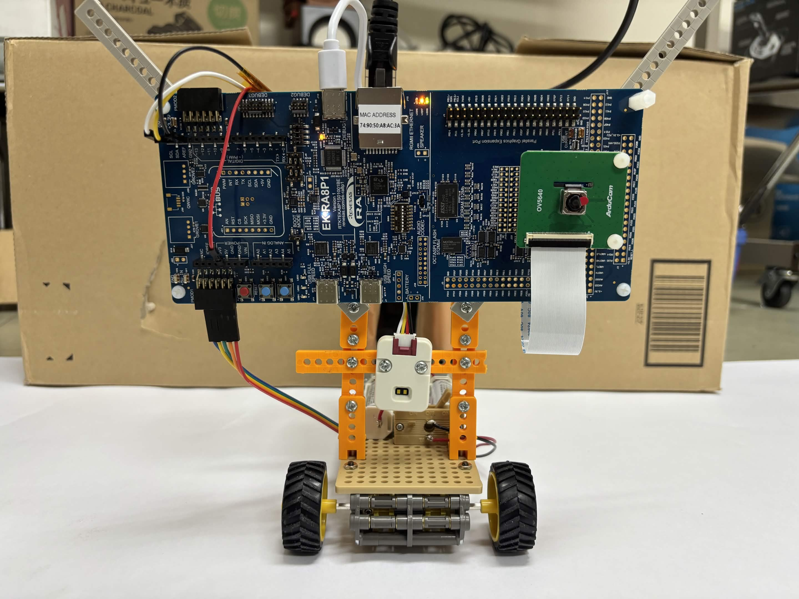

完成した車体。前方にカメラと距離センサを取り付けています。

---

## デモ動画・紹介資料

[紹介資料（PowerPoint原本）](docs/autonomous-driving-batontouch.pptx) / [閲覧用PDF](docs/autonomous-driving-batontouch.pdf)：作品の目的、システム構成、組み立て・接続、Web画面での操作をまとめています。

[走行デモ（YouTube）](https://youtu.be/EPq6gM8SDfI)：MANUALモードでの直進・旋回と、AUTOモードでの走行・自動停止を紹介します。

## プロジェクトの目的

この教材の目的は、組み立てた車両を走らせながら、**人と自動運転の役割が切り替わる場面**を体験することです。車両が自動走行を続けられないとき、なぜ止まり、どのように人へ操作を引き継ぐのかをWeb画面で確かめられます。

車載カメラの画像から白い走行路を認識し、車両はその道に沿って走ります。AIが進路上の人や車を検知すると、Web画面に手動操作を勧める警告を出します。検知だけでは走行モードを変えません。走行路を見失った場合は車両を止め、3秒間、手動への切り替えを待ちます。前方が近すぎるとき、手動操作が途絶えたとき、M85からの通信が途絶えたときも停止します。

利用者はスマートフォンやPCのWeb画面で、走行モード、前方距離、停止理由を確認できます。カメラ・AI・WebはM85、安全判定とモーター出力はM33が担当します。**最終的にモーター出力を決めるのはM33だけ**です。

## システム構成

操作端末はルーターにWi-Fiで接続し、ルーターとEK-RA8P1は有線LANで接続します。WebアプリはM85からHTTPで配信され、端末のブラウザに表示されます。

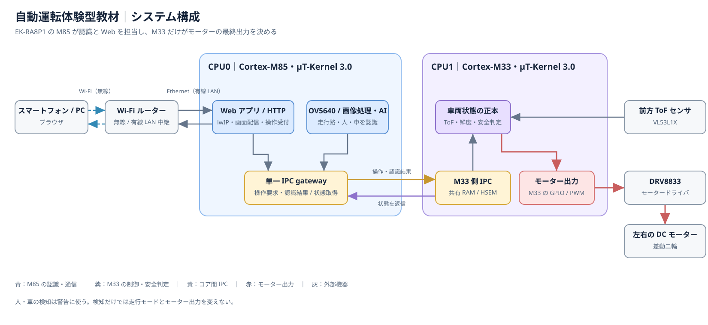

編集用ファイル：[システム構成図（draw.io）](docs/system_architecture.drawio)

- ブラウザの操作要求はM85のIPC gatewayを経てM33へ届きます。M33が返したモード・停止理由・前方距離はWeb画面に表示されます。
- M85は走行路と人・車の認識結果をM33へ送ります。モーター出力を決めるのはM33です。

## 動作モードと一連の動作

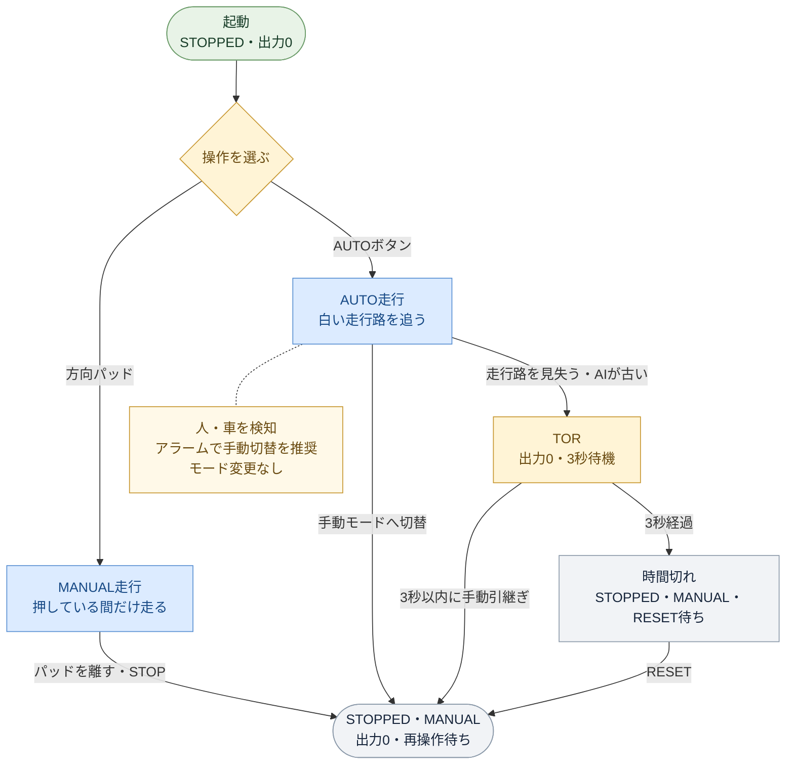

図は上から下へ読みます。AUTO走行中にモード切替ボタンを押すか、TOR中に「手動操作に切り替える」を押すと、出力0のSTOPPED・MANUALになります。切替だけでは走りません。方向パッドを改めて押すと手動走行します。TORを3秒放置した場合は、RESETで時間切れの中断画面を解除してから方向パッドを押します。走行路が再び見えても、TORからAUTOへ自動復帰しません。通常停止と緊急停止の条件は下表も参照してください。

走行開始には有効なToF測定値（100 mm超）とM85からの通信が必要です。AUTOでは走行路の認識結果も必要です。MANUAL/AUTO中のSTOPと前方51～100 mmは通常停止です。手動ボタンを離したときや、操作が300 ms途絶えたときも止まります。走行中またはTOR中の前方50 mm以内・ToF異常は緊急停止です。走行中のM85停止とESTOPも緊急停止です。ToFや通信が回復すれば停止状態に戻りますが、ESTOPと内部異常はWebのRESETでは解除できません。人・車の検知はWeb画面への警告のみで、モードを変えません。停止後は自動で再発進しません。

| 状態 | 内容 |
|---|---|
| **MANUAL** | ボタンを押している間だけ走る。後退はしない。操作が300 ms途切れると停止 |
| **AUTO** | 認識した白い走行路に沿って走る。距離センサ・通信・走行路認識が使えないと開始しない |
| **停止（STOPPED）** | 前方51～100 mm、手動操作の途絶、TORの時間切れなどで停止。緊急停止の一時異常が回復した後もここに戻る。自動では再発進しない |
| **EMERGENCY** | 走行中やTOR中の前方50 mm以内・距離センサ異常、走行中のM85停止、ESTOPで緊急停止。WebのRESETではESTOPを解除できない |
| **人・車の検知** | 進路上の人・車を検知すると、Webに手動操作を勧める警告を出す。前方距離が300 mm以内なら測定値も表示するが、人・車までの距離とは限らない。検知だけではモードや出力を変えない |
| **TOR（運転引き継ぎ要求）** | AUTO中に走行路を見失うかAIが途絶えると、出力0で3秒間、手動への切り替えを待つ。引き継ぎ後もパッドを押すまでは走らない。時間切れ後はRESETが必要 |

## 必要なもの

以下は実機で使った部品です。互換品を使う場合は電圧、端子、寸法を確認してください。このREADMEでは車体の組み立てとケーブル接続を説明します。

### 制御・センサ・通信

| 製品名 | 型番 | 数量 | 用途 |
|---|---|---:|---|
| Renesas EK-RA8P1 Evaluation Kit | EK-RA8P1 | 1 | 両コアの制御、認識、Web配信 |
| モータードライバ | DRV8833 | 1 | 左右DCモーターの駆動 |
| M5Stack用ToF測距センサユニット（VL53L1X） | M5STACK-U172（スイッチサイエンス 9427） | 1 | 前方のToF測距 |
| EK-RA8P1付属カメラ | OV5640 | 1 | 前方画像の取得 |
| ポータブルルーター（実機例） | ELECOM WRH-733GBK | 1 | 基板の有線LANと操作端末のWi-Fiを接続 |

ルーターは別の機種でも構いません。基板の固定IPは `192.168.2.200/24` です。操作端末からこのIPに接続できるよう設定してください。

### 車体・電源・工具

| 製品名 | 型番 | 数量 | 用途 |
|---|---|---:|---|
| タミヤ ツインモーターギヤーボックス | ITEM 70097 | 1 | 左右の車輪を独立駆動 |
| タミヤ トラックタイヤセット | ITEM 70101 | 1 | 駆動輪 |
| タミヤ ボールキャスター | ITEM 70144 | 1 | 車体後部の支持 |
| タミヤ ユニバーサルプレートセット | ITEM 70098 | 1 | 下段のベース |
| タミヤ ユニバーサルアームセット | ITEM 70143 | 1 | フレーム固定 |
| タミヤ ロングユニバーサルアームセット | ITEM 70156 | 1 | 上段フレーム |
| タミヤ ユニバーサルアームセット（オレンジ） | ITEM 70183 | 1 | 車体フレームと機器の固定 |
| スティック型モバイルバッテリー 3000 mAh | Premium Style PG-LBJ30A01BK | 1 | EK-RA8P1等へのUSB給電 |
| タミヤ 単3電池ボックス（1本用・スイッチ付） | ITEM 70150 | **3** | モーター系の独立電源 |
| タミヤ ミニ四駆バッテリー パワーチャンプRX | — | 3 | モーター系の独立電源 |

操作端末はスマートフォン、タブレット、PCのいずれか1台です。専用アプリは不要です。工具にはプラスドライバー、ニッパー、カッター、ハサミを使います。部品の固定具と、ケーブルの絶縁材も用意してください。

テストコースには幅45 cm程度の白いロール画用紙を使い、テープで固定します。距離センサの停止試験には箱を使ってください。人を車両の前に立たせて試験しないでください。

## 車体の組み立て

車体は2層構成です。下段に駆動部と電池ボックス、上段に基板・モバイルバッテリー・ルーターを載せます。

1. **駆動部**：ITEM 70097を左右独立の構成で組み立てます。実機ではギヤ比203.7:1を使用します。左右の出力軸を手で回し、引っかかりがないことを確認します。
2. **車輪と支持**：ITEM 70101の左右タイヤとITEM 70144のボールキャスターを取り付け、3点が接地し、タイヤが他の部品に触れず回ることを確認します。
3. **下段**：ITEM 70098のプレートにギヤーボックスとキャスターを固定します。ITEM 70150の電池ボックス**3個**を、電池交換とスイッチ操作ができる向きで固定します。左右に大きな重量差を作らないようにします。
4. **上段**：ITEM 70143、70156、70183のアーム類で電池ボックスより高いフレームを作り、モバイルバッテリーとルーターを固定します。端子やスイッチが外から操作できるようにします。
5. **基板・センサ**：EK-RA8P1を縦向きに安定して固定し、カメラとToFを進行方向に向けます。カメラは実機の取り付け向きに合わせてファームウェアが画像を180°回転します。ToFが車体や床を誤検出しない位置・角度に調整し、ケーブルをタイヤから離します。
6. **電源を入れる前の点検**：車輪とキャスターの接地、フレームのぐらつき、電池の交換可能性、電源スイッチ・USB・LAN端子へのアクセス、センサの向き、ケーブルの擦れ・短絡がないことを確認します。

| 下段の表側 | 下段の裏側 |
|---|---|
| 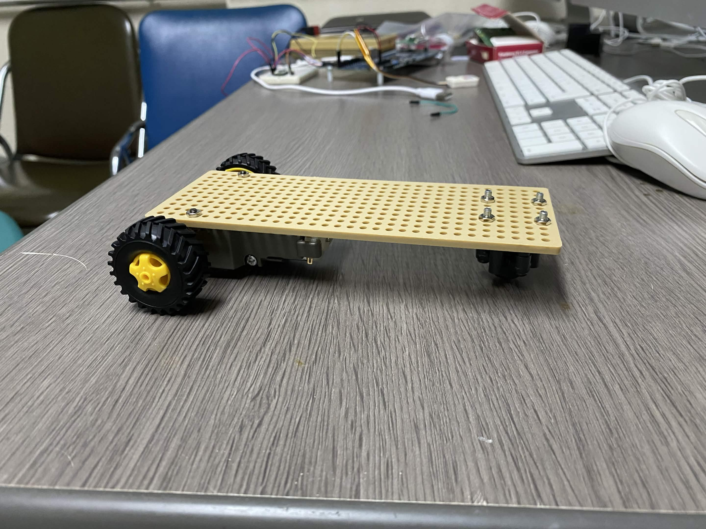 | 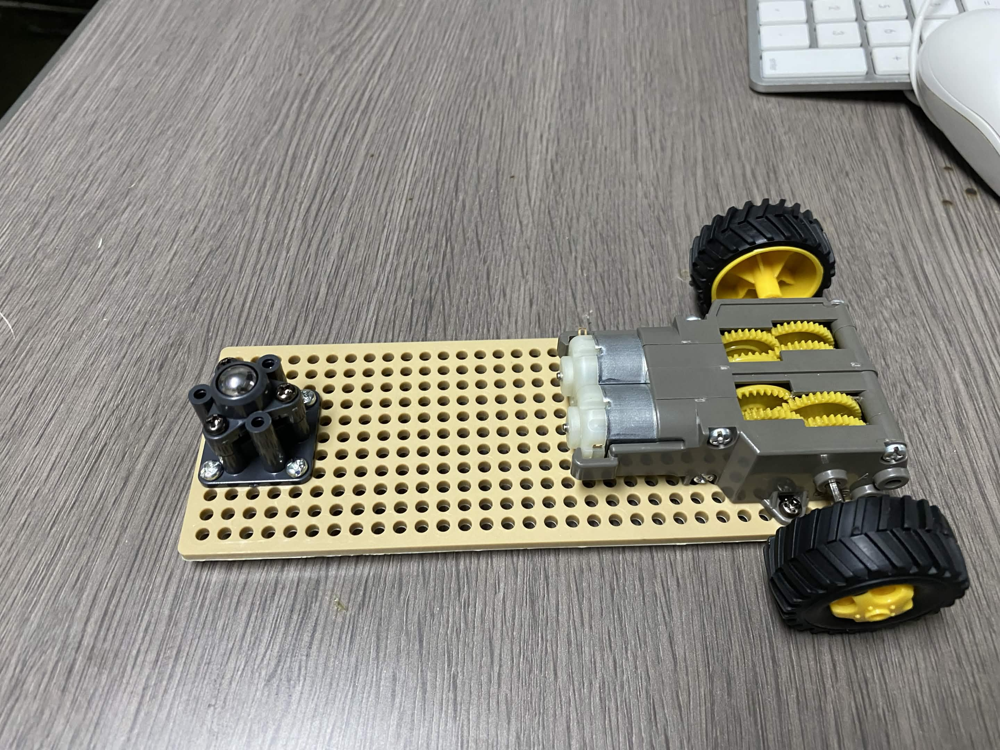 |

プレートの裏側にギヤーボックスとボールキャスターを固定します。

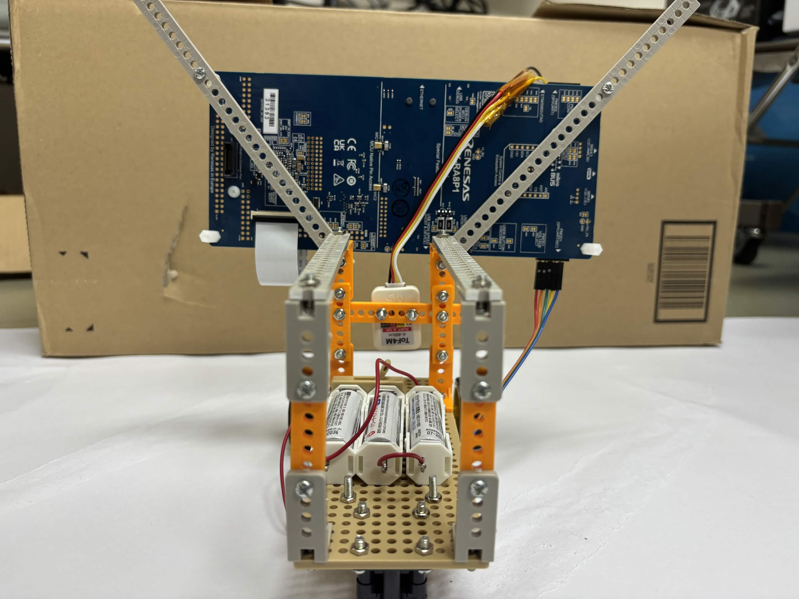

基板は斜めのアームとスペーサーで固定します。

## はんだ付けする配線

右車輪用モーターをAOUT1/AOUT2、左車輪用モーターをBOUT1/BOUT2に接続します。モーター側の赤線はAOUT1/BOUT1、黒線はAOUT2/BOUT2です。電池ボックス3個は直列につなぎ、物理スイッチでモーター用電源を切り替えます。

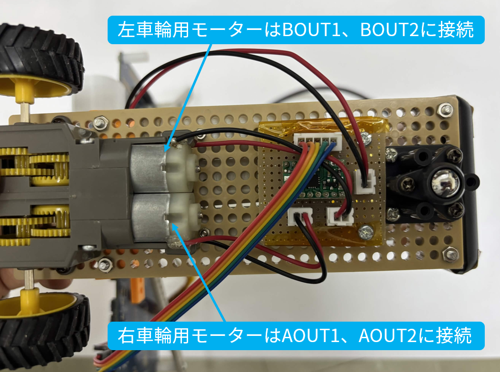

導線の準備、モーターと電池ボックスの配線、通電前の点検は[はんだ付けの手順](docs/SOLDERING.md)を参照してください。

## 接続

車輪を浮かせ、モーター用電池ボックスのスイッチをOFFにしてから接続を確認します。線の色はこの車体の配線に合わせています。部品を替える場合は端子名も確認してください。

### モータードライバとEK-RA8P1

5本の線をPMOD1（J26）の下段側につなぎます。位置だけで判断せず、J26のピン番号も確認してください。

| 線の色 | DRV8833側 | EK-RA8P1側 |
|---|---|---|
| 赤 | AIN1 | J26-7（P006） |
| 橙 | AIN2 | J26-8（P402） |
| 黄 | BIN2 | J26-10（P413） |
| 緑 | BIN1 | J26-9（P412） |
| 青 | GND | J26-11（GND） |

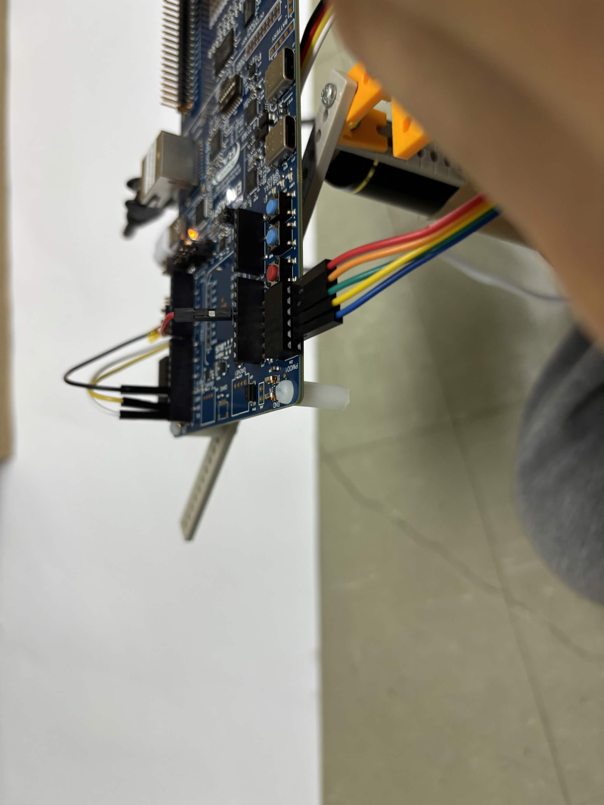

PMOD1への接続例。線の色とピン番号は上表で確認してください。

### 距離センサとEK-RA8P1

| 線の色 | 距離センサ側 | EK-RA8P1側 |
|---|---|---|
| 赤 | 5V | J18-5（5V） |
| 黒 | GND | J24-7（GND） |
| 黄 | SDA | J24-9（P511） |
| 白 | SCL | J24-10（P512） |

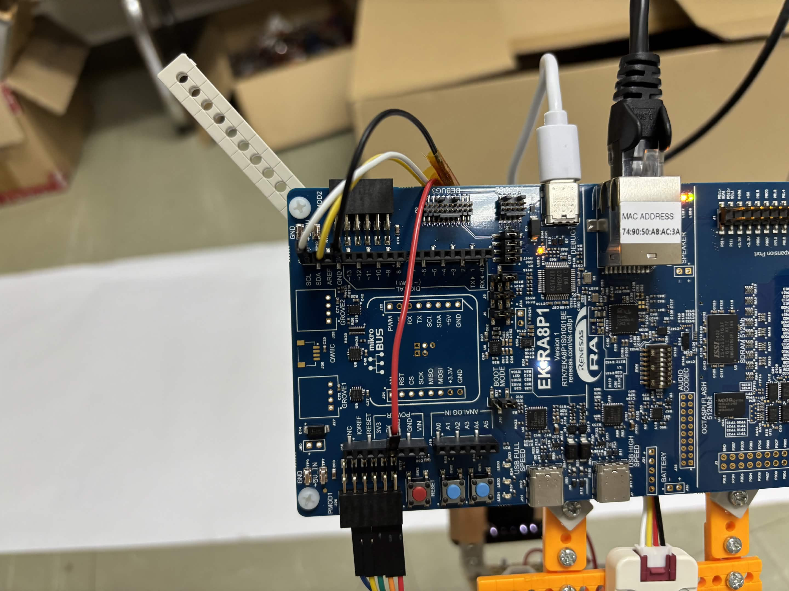

距離センサの基板側接続例。端子は上表を参照してください。

### その他のケーブル

| 接続 | 接続先 |
|---|---|
| カメラ（OV5640） | EK-RA8P1のMIPI CSIコネクタ |
| LAN | EK-RA8P1のEthernetポートとルーターのLANポート |
| 基板のUSB電源 | EK-RA8P1のJ-Link OB側とモバイルバッテリーまたはPC |

モーター用の単3電池3本は基板のUSB電源とは別系統です。電源端子の極性と定格を通電前に確認してください。

カメラは上下逆向きに取り付け、画像をファームウェアで180°回転します。センサとカメラのケーブルはタイヤに触れないよう固定します。接続後も、Web画面とセンサの確認が済むまでモーター用電池ボックスのスイッチをOFFにしてください。

## GitHubから初めて再現する場合

書き込みには、組み立て済みの車体、e² studio 2026-04.2 / FSP 6.5.0、Arm Toolchain for Embedded LLVM 21.1.1、Python 3、J-Link接続が必要です。Windowsでは英数字だけの短いパス（例 `C:\TRON`）を使ってください。書き込み済みの車体を動かすだけなら「起動方法」へ進みます。

1. 新しいフォルダへ `git clone https://github.com/tut-cc/tron-2026-autonomous-driving.git C:\TRON\tron-2026-autonomous-driving` で取得します。日本語を含む親フォルダは避けます。
2. e² studioの新しい英数字パスのワークスペースで **Existing Projects into Workspace** を選び、取得フォルダを指定して `ra8p1_vision_CPU0`、`ra8p1_vision_CPU1`、`ra8p1_vision_Solution` を取り込みます。**Copy projects into workspaceはOFF**にします。
3. `ra8p1_vision_Solution` を **Build Project** し、コンソールに `CPU0 OK` と `CPU1 OK` が出ることを確認します。`0 errors` だけでビルド成功とは判断しません。必要ならリポジトリ直下で `python -B tools/make_evidence.py` を実行し `PASS` を確認します。
4. 車輪を浮かせ、**モーター用電池ボックスの物理スイッチをOFF**にしたまま、`CPU0/ra8p1_vision_BothCore_Download.launch` を **Debug As** で起動して両コアへ書き込みます。`ダウンロード終了` を確認したら **F8** で再開し、デバッガを切断します。通常のPC向けRunボタンでは基板上のARM ELFは実行されません。
5. この後、下記の「起動方法」と[実機確認の手順](docs/HARDWARE_TEST.md)に従い、まずモーター用スイッチOFFの状態で接続・センサ・状態を確認します。

環境変数、書き込み画面、検証コマンドの詳細は[GitHubからの導入手順](docs/GITHUB_SETUP.md)を参照してください。ソースを変更した場合は、同梱済みELFをそのまま使わず両コアを再ビルドします。

## 起動方法（Getting Started）

この節は、完成品車体に両コアのファームウェアが書き込まれている場合の起動手順です。

### 1. 電源投入
1. 車輪を浮かせ、タミヤのモーター用電池ボックスの物理スイッチを **OFF** にする。モーターとDRV8833の配線はそのままでよい。OFFでモーター系へ給電されないことを確認する。
2. ルーターの電源を入れ、EK-RA8P1 と LAN ケーブルでつながっていることを確認する。**LAN ケーブルは基板の電源投入前に挿す**。
3. EK-RA8P1 に USB 給電する。起動時間は環境によって異なります。

### 2. スマートフォンをネットワークに接続
ルーターの Wi-Fi に接続する。

使用するルーターのSSIDとパスワードを確認してください。ファームウェアに固定のSSID・パスワードはありません。操作端末には、`192.168.2.0/24` 内で基板の固定IP `192.168.2.200` と重複しないIPアドレスを割り当てます。ルーターが別のネットワークを使う場合は、ルーター設定または `M85Web/Application/app_main_httpd.c` の静的IP設定を合わせ、両コアをビルドし直してください。

### 3. Web UI を開く
ブラウザで **http://192.168.2.200/** を開く。画面上部に状態と前方距離（mm）が表示されれば接続成功です。起動直後はMANUAL・停止状態です。
（固定 IP。ゲートウェイ 192.168.2.1、ネットマスク 255.255.255.0）

### 4. モーター用電源を入れずに確認
[実機確認の手順](docs/HARDWARE_TEST.md)の「段階 A」を行います。Webの状態、前方距離、停止・モード切替を確認してください。この段階ではタイヤは回りません。

### 5. モーター用電源を入れて確認
段階 A の確認がすべて終わったら、車輪を浮かせたままモーター用電池ボックスのスイッチをONにします。短時間の回転確認は[実機確認の手順](docs/HARDWARE_TEST.md)の「段階 B」に従ってください。異常があればすぐOFFに戻します。床上走行は段階 B の合格後です。

### 6. MANUAL で動作確認
左手で画面左下の「▲」を押している間、車両が前進すること、離すと止まることを確認する。右手で画面右の「◀」「▶」を押すと旋回し、▲と同時に押すと曲がりながら進む。PC ではキーボードの `↑/W`・`←/A`・`→/D` でも操作できる。

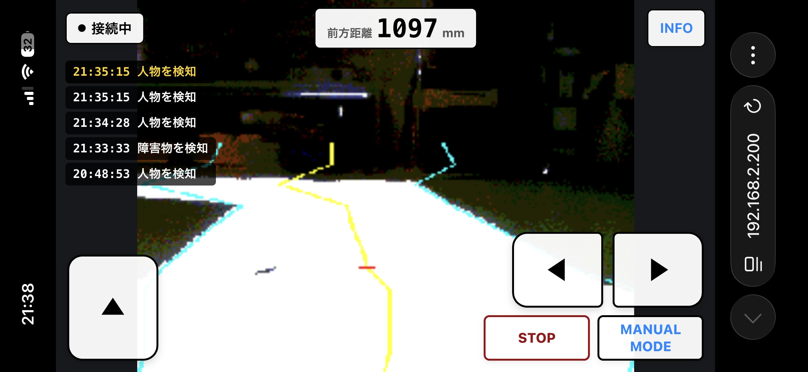

MANUALの操作画面。Web画面の写真は撮影時の例で、警告文などは版によって異なります。

### 7. AUTO
車両を白い路面に置き、`MANUAL MODE` ボタンでAUTOに切り替えます。走行路を認識できない場合は開始しません。停止には`STOP`またはMANUALへの切り替えを使います。中断後はボタンが`RESET`に変わりますが、押しても自動では再発進しません。ESTOPや内部異常はWebのRESETでは解除できません。異常時はモーター用電池ボックスのスイッチをOFFにしてください。

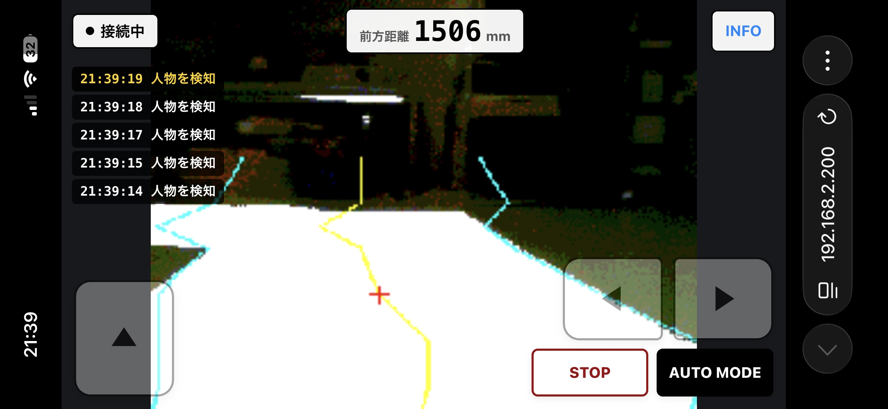

AUTO中は方向ボタンが無効になります。

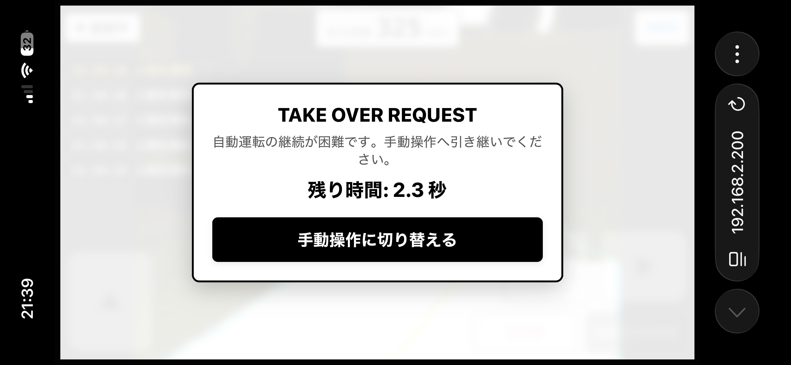

走行路を見失うなどでTORが発生すると、車両を停止し、3秒間、手動への切り替えを待ちます。人・車の検知だけではTORに移行しません。

停止距離、障害物の警告、TORなどの試験項目は[実機確認の手順](docs/HARDWARE_TEST.md)にまとめています。

## TRON / μT-Kernel 3.0 の使い方

2 つのコアの両方で μT-Kernel 3.0 を動かしています。

**CPU1（Cortex-M33）：安全制御**
| 優先度 | タスク | 役割 |
|---:|---|---|
| 1（最高） | emergency | 緊急停止の処理 |
| 2 | motor | モーター出力（DRV8833、PWM 上限・加速制限） |
| 3 | distance | 距離センサ（ToF）の監視 |
| 4 | decision | 状態遷移（MANUAL / AUTO / 停止 / 緊急停止）と安全判定 |
| 5 | web | Web からの操作要求の受付 |
| 6 | vision | AI 認識結果の受付と鮮度チェック |
| 7 | status | 状態の通知（CPU0 / Web へ） |

- **安全系（緊急停止・モーター・距離監視）を、AI や Web の処理より高い優先度で動かす**ことで、認識や通信が混んでも停止処理が遅れないようにしています。
- タスク間は μT-Kernel のメッセージバッファ・イベントフラグ・優先度継承ミューテックスでつなぎ、走行中に動的メモリ確保をしません。

**CPU0（Cortex-M85）：認識と通信**
| 優先度 | タスク | 役割 |
|---:|---|---|
| 8 | IPC gateway | CPU1 への認識結果・操作要求の送信（STOP/ESTOP は専用スロットで優先） |
| 10 | lwIP | Web サーバー（HTTP） |
| 12 | camera | カメラ取得・AI 推論・走行路認識 |
| 20 | video | Web 用の最新BMP映像生成（低優先度） |
| 22 | USB diagnostic | PCビューア用の診断映像送信（さらに低優先度、操作には不要） |

## ソースコード構成

```text
.
├── README.md
├── CPU0/        EK-RA8P1 Cortex-M85：カメラ・AI・Web・IPC送信（μT-Kernel 3.0 + lwIP）
│   ├── src/         アプリケーション（mipi_csi.c, obstacle_*.c/cc, road_navigation.c, ...）
│   ├── model/       YOLO-Fastest（Vela 変換済み）
│   └── pc_viewer/   PC 用 USB 画像ビューア（AI の認識結果を表示）
├── CPU1/        EK-RA8P1 Cortex-M33：安全制御（μT-Kernel 3.0）
├── control/     状態遷移・安全判定・IPC・モーター出力（両コア共通、PC テスト付き）
├── M85Web/      Web UI（mini-4wd-webapp）と HTTP / 制御 API
├── Solution/    e² studio 用（両コアをまとめるプロジェクト）
├── tools/       ビルド・PCテスト・書き込み前検証の Python スクリプト（build / test_host / manifest / verify / make_evidence）
└── docs/        導入・実機確認の手順、検証ログ、変更履歴
```

## トラブルシューティング

| 症状 | 対処 |
|---|---|
| Web が開けない | スマホがルーターの Wi-Fi（192.168.2.x）にいるか。LAN ケーブルを挿してから EK-RA8P1 の電源を入れ直す |
| AUTO が拒否される | 画面の理由を見る。「走行路…」なら白い路面が画面下半分に大きく映るように置き、照明を明るくする。「距離センサー…」なら前方 100 mm 以内に物がないか、ToF の配線 |
| MANUAL がすぐ止まる | Wi-Fi の遅延で操作要求が 300 ms 以上途切れている。ルーターに近づく |
| 停止後に動かない | 仕様（安全のため自動では再発進しない）。もう一度ボタン操作をする。停止理由が「ボタンによる緊急停止」なら基板をリセットする |
| 映像が止まる・遅い | INFO の GET 時間・フレーム率を見る。映像は制御より低優先のベストエフォート（目標 10 fps、保証なし）で、映像が止まっても制御の安全判定には影響しない |

---

## 開発者向け

**環境**：e² studio 2026-04.2、FSP 6.5.0、Arm Toolchain for Embedded LLVM 21.1.1、Python 3、Node.js、ホスト用 GCC

**ビルドと書き込み前チェック**（英数字だけの短いパス、例 `C:\TRON\demo`）
- 開発中：ビルドボタン（ハンマー）でビルドだけ行う。
- 書き込み前：リポジトリ直下で `python -B tools/make_evidence.py` を実行し、`PASS` を確認する。

**書き込み**：車輪を浮かせ、モーター用電池ボックスのスイッチをOFFにします。Project Explorerで `CPU0/ra8p1_vision_BothCore_Download.launch` を右クリックし、Debug Asを選びます。書き込み後はF8で再開し、デバッガを切断してください。

**詳細資料**：[GitHubからの導入](docs/GITHUB_SETUP.md)、[実機確認](docs/HARDWARE_TEST.md)、[開発・検証](docs/DEVELOPMENT.md)、[ピン割当](docs/PIN_OWNERSHIP.md)、[両コア起動](docs/BRINGUP.md)

## ライセンスとAIモデルの出典

本プロジェクトのオリジナルプログラムは[MITライセンス](LICENSE)で公開しています。著作権者は `tron-2026-autonomous-driving contributors` です。著作権表示とライセンス本文を残して、改造・再配布できます。

第三者のソフトウェア・AIモデルには、それぞれのライセンスが適用されます。本プロジェクトのMITライセンスで、その条件を変更するものではありません。権利表示と出典は[NOTICE.md](NOTICE.md)と[CPU0/THIRD_PARTY_NOTICES.md](CPU0/THIRD_PARTY_NOTICES.md)を参照してください。

人物や車の検知に使うモデルは、[YOLO-Fastest v1.1](https://github.com/dog-qiuqiu/Yolo-Fastest)を基にしたCOCO 80クラスのモデルです。実際に組み込んでいるのは、[OpenNuvotonの物体検知サンプル](https://github.com/OpenNuvoton/NuMaker-Zephyr-TFLM-ObjectDetection)を取得元とする、Ethos-U NPU向けに最適化されたモデルです。ファイルと変換仕様は[CPU0/model/README.md](CPU0/model/README.md)に記載しています。

取得元が示すモデルの出所は[OpenNuvoton/ML_YOLO](https://github.com/OpenNuvoton/ML_YOLO)です。YOLO-Fastestの原典には「YOLO LICENSE」があり、ML_YOLOにはApache-2.0のライセンスと、その表記を持つモデルデータがあります。ただし、現行の最適化モデルと学習済み重みに適用される再配布条件は、まだ確定していません。再配布前に取得元へ確認してください。調査の根拠は[CPU0/model/README.md](CPU0/model/README.md)に記載しています。

## 安全上の注意と免責

本プロジェクトは教育・実験目的で公開しています。ソフトウェアや手順の完全性・安全性は保証しません。車体の組み立て、配線、通電、走行には、短絡や予期しない動作などの危険があります。周囲の安全を確保し、車輪を浮かせて、モーター用電池ボックスのスイッチをOFFにした状態から段階的に確認してください。
