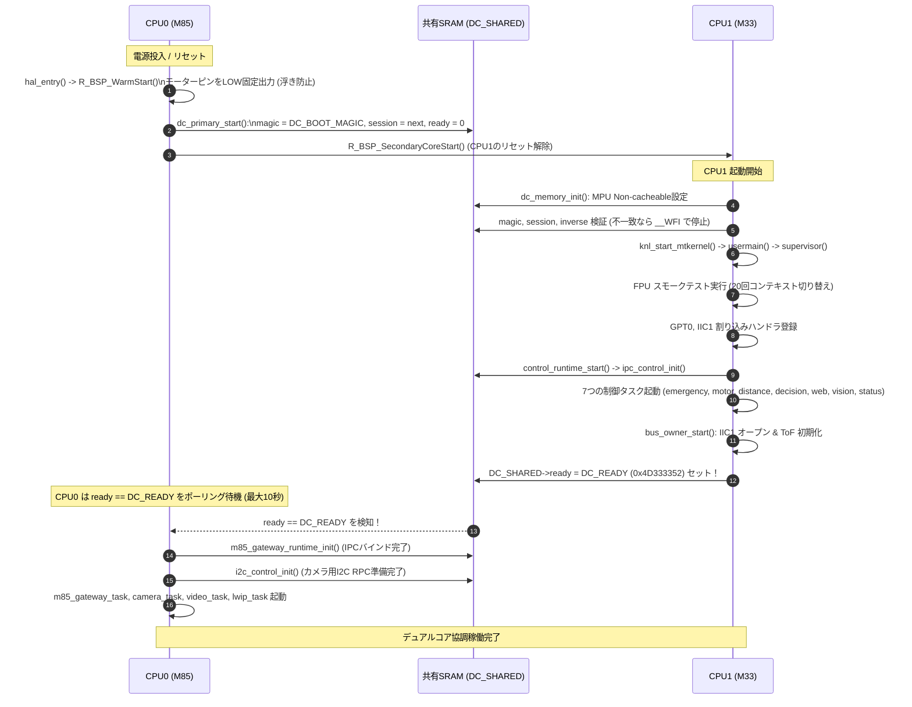
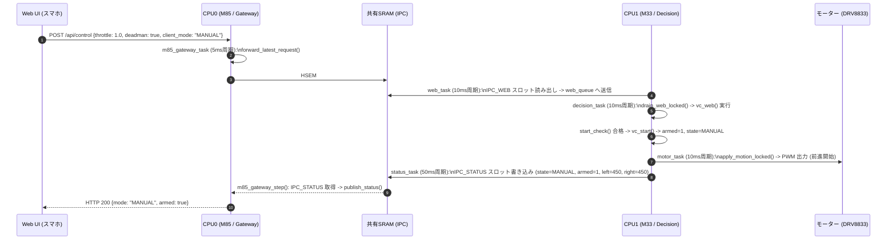
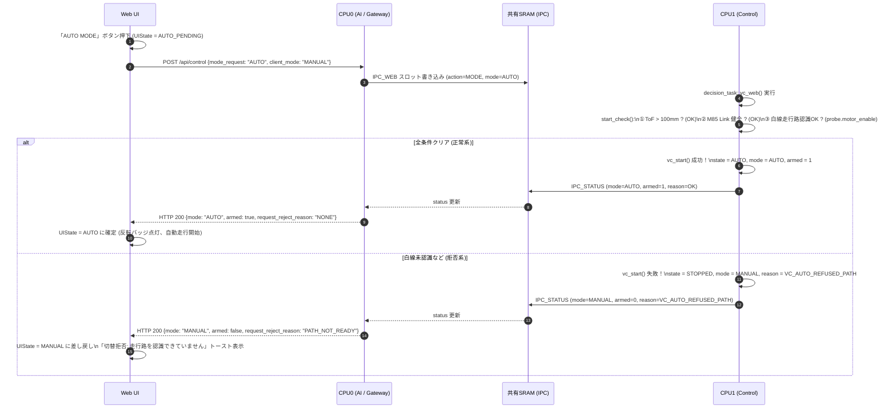
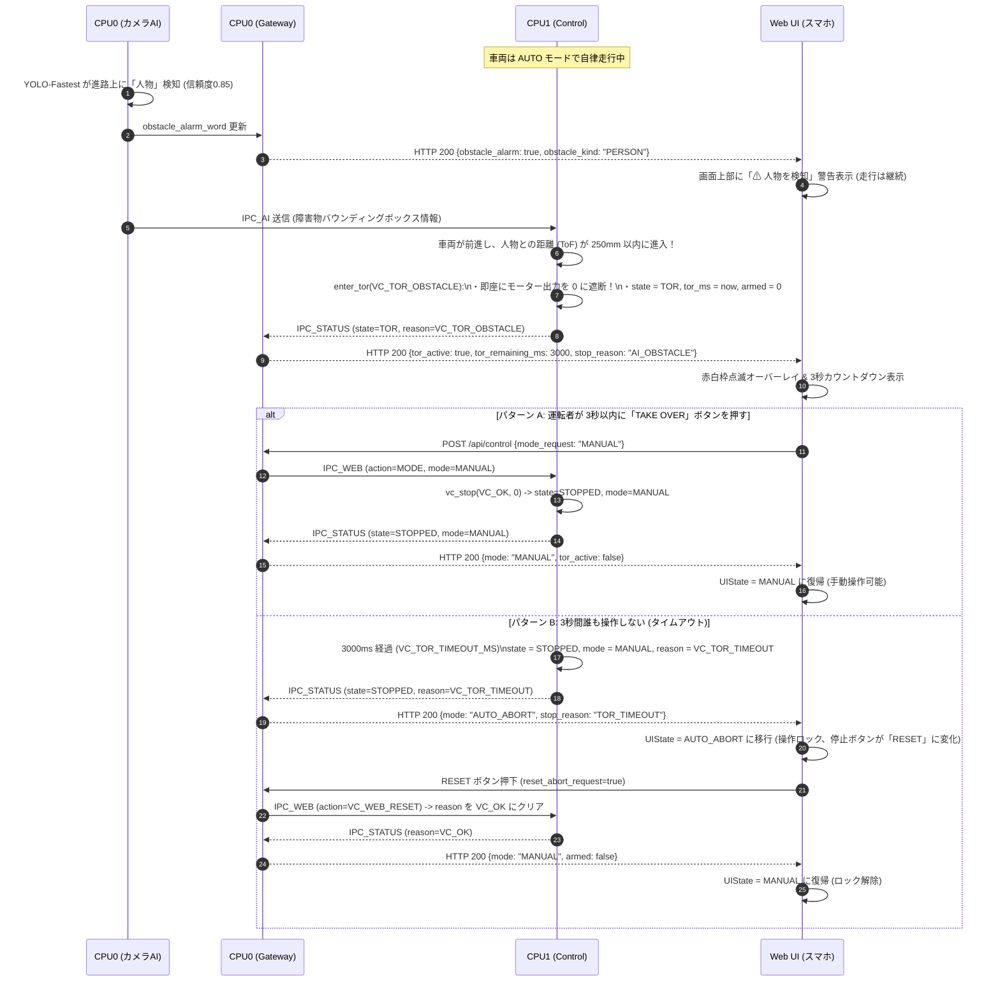
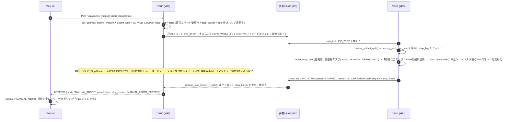

# CPU間競合解析およびデュアルコア協調状態遷移仕様書

本ドキュメントは、車載マイコン EK-RA8P1 上で動作する **CPU0（Cortex-M85）** と **CPU1（Cortex-M33）** のソースコードを徹底解析し、「CPUどうしで競合（リソース競合・レースコンディション・状態の奪い合い・デッドロック等）が発生していないか？」という疑問に対する詳細な技術的検証結果と、デュアルコア間の協調状態遷移モデルをまとめたものです。

---

## 1. エグゼクティブサマリー：CPUどうしで競合していないか？

### 結論
**CPU0（M85）と CPU1（M33）の間で、致命的な競合（データの破壊、操舵権の奪い合い、デッドロック、危険な誤動作・暴走）は発生しないよう、極めて堅牢に設計・実装されています。**

### なぜ競合しないのか？（3つの設計原則）

```mermaid
flowchart TD
    subgraph CPU0 ["CPU0: Cortex-M85 (知覚・通信コア)"]
        AI["AI画像認識\n(YOLO / 走行路検出)"]
        WEB["lwIP HTTP Server\n(Web UI通信)"]
        AI_OUT["特徴量抽出のみ\n(操舵指令は計算しない)"]
        IPC_TX["共有メモリ IPC 送信\n(スロット分離 / Stop Barrier)"]
        AI --> AI_OUT --> IPC_TX
        WEB --> IPC_TX
    end

    subgraph MEM ["共有SRAM (0x221D3000) & ハードウェア調停"]
        MPU["MPU Non-cacheable\n(キャッシュ不整合なし)"]
        HSEM3["ハードウェアセマフォ #3\n(IPC排他 / 非ブロッキング)"]
        HSEM4["ハードウェアセマフォ #4\n(I2C RPC排他)"]
    end

    subgraph CPU1 ["CPU1: Cortex-M33 (車両制御・安全の唯一の正本)"]
        VC["vehicle_control.c (vc_t)\n【唯一の車両状態決定権】"]
        MOTOR_CTRL["control_motor.c\n【唯一のモーター・操舵計算】"]
        I2C_OWNER["bus_owner.c\n【I2C1 ペリフェラル唯一の所有者】"]
        PWM["GPT0 / DRV8833\n【モーターPWMピン唯一の所有者】"]
        VC --> MOTOR_CTRL --> PWM
    end

    IPC_TX -->|非ブロッキング書き込み| MEM
    MEM -->|定期読み出し| VC
    CPU0 -.->|I2Cアクセス依頼 (RPC)| MEM
    MEM -.->|代理実行| I2C_OWNER
```

1. **単一主権アーキテクチャ（Single Authority Principle）**:
   - 車両の走行状態（`STOPPED`, `MANUAL`, `AUTO`, `TOR`, `EMERGENCY`）およびモーター出力（PWM, Slewレート, 加減速）を決定する権利は、**100% CPU1（M33）に集約**されています。
   - CPU0（M85）は「カメラAIによる知覚結果（白線の位置・傾き、障害物バウンディングボックス）」と「Web UIからの操作要求」をCPU1へ通知する **センサー / ゲートウェイ** に過ぎず、車両状態を自ら書き換えたり、モーターピンを操作する権限を持ちません。
2. **ハードウェア資源の物理的分離（Strict Hardware Separation）**:
   - モーター駆動ピン（PMOD1 GPIO/PWM）は CPU1 のみが専有制御します（CPU0はブート直後のプルダウン固定以降、一切アクセスしません）。
   - ボード上の同一I2Cバスにカメラ（CPU0用途）とToFセンサ（CPU1用途）が同居していますが、**CPU1が唯一のバスオーナー（`bus_owner`）** となり、CPU0は直接ペリフェラルを叩かずRPC（代理実行）を介して通信します。
3. **共有メモリとハードウェアセマフォによる非ブロッキング排他制御**:
   - 共有SRAM領域（`0x221D3000`）は MPU で **Non-cacheable（キャッシュ無効）** に設定されており、コヒーレンシの崩れがありません。
   - コア間の排他はオンチップのハードウェアセマフォ（HSEM #3, #4）を使用し、**ビジーウェイトを排除した非ブロッキング（`try_lock` -> 失敗時は `IPC_BUSY` で次周期リトライ）** で設計されているため、デッドロックが物理的に発生しません。

---

## 2. ハードウェア資源およびペリフェラルの所有権マップ

CPU0 と CPU1 における資源の所有権分担は下表の通り厳密に分離されています（[`PIN_OWNERSHIP.md`](file:///C:/TRON/demo/docs/PIN_OWNERSHIP.md) 準拠）。

| 資源・ペリフェラル | CPU0 (Cortex-M85) | CPU1 (Cortex-M33) | 競合防止策 |
|---|---|---|---|
| **モーター駆動ピン**<br>(P006, P402, P412, P413) | 所有しない（アクセス禁止） | **DRV8833 専有制御**<br>(AIN1/2, BIN1/2) | CPU0はブート直後に浮き防止でLOWを出力した後は一切アクセスしない。 |
| **モータータイマー**<br>(GPT0) | 所有しない | **PWM制御 専有**<br>(100 µs ティック) | タイマー割り込み（GPT0 ISR）は CPU1 のみで動作。 |
| **I2Cバス**<br>(IIC1: P511/P512) | 直接アクセスしない<br>(RPCクライアント) | **唯一のバスオーナー**<br>(`bus_owner.c`) | CPU0からのカメラ初期設定等は共有メモリRPC経由でCPU1が代理実行。 |
| **ToF 距離センサ**<br>(VL53L1X: 0x52) | アクセスしない | **専有アクセス**<br>(10ms周期 測距) | I2Cバス上でToF通信を最優先でスケジュール。 |
| **カメラセンサ**<br>(OV5640 / MIPI CSI) | **専有**<br>(画像取込・NPU推論) | アクセスしない | 映像ストリーム・推論処理は CPU0 内部で完結。 |
| **Ethernet / lwIP**<br>(HTTP Web Server) | **専有**<br>(Web UI配信・REST API) | アクセスしない | ネットワーク通信スタックは CPU0 内部で完結。 |
| **共有RAM**<br>(0x221D3000–0x221D3FFF) | IPC送信 / テレメトリ受信 | IPC受信 / テレメトリ送信 | MPU Region 7（Non-cacheable）、メモリバリア（`__DMB()`）。 |
| **ハードウェアセマフォ**<br>(HSEM #3, #4) | HSEM取得・解放 | HSEM取得・解放 | 非ブロッキング取得。デッドロック防止。 |

---

## 3. CPU間協調状態遷移モデル

車両の真の状態遷移を司る **CPU1（M33）** と、ユーザーインターフェースおよびAI認識を司る **CPU0（M85）** の協調状態遷移モデルです。

### 3.1 デュアルコア協調状態遷移図

```mermaid
stateDiagram-v2
    [*] --> BOOT: 電源ON / リセット

    state BOOT {
        [*] --> CPU0_INIT: CPU0 起動 (FSP / LOW固定)
        CPU0_INIT --> SHARED_INIT: dc_primary_start()\n共有メモリ初期化・Magic書き込み
        SHARED_INIT --> CPU1_RELEASE: SecondaryCoreStart()\nCPU1リセット解除
        CPU1_RELEASE --> CPU1_SUPERVISOR: CPU1 μT-Kernel 起動\nスモークテスト & IPC初期化
        CPU1_SUPERVISOR --> HANDSHAKE_DONE: DC_READY (0x4D333352) セット
        HANDSHAKE_DONE --> [*]: CPU0 Gateway / lwIP 起動
    }

    BOOT --> STOPPED: ブート完了 (初期状態: mode=MANUAL, armed=0, reason=WAITING)

    state "CPU1 稼働状態 (車両状態の正本)" as ACTIVE_M33 {
        %% STOPPED
        state STOPPED {
            note right of STOPPED
                モーター出力 = 0 (ブレーキ)
                armed = 0
            end note
        }

        %% MANUAL
        state MANUAL {
            note right of MANUAL
                手動走行中 (D-pad押下中)
                armed = 1, mode = MANUAL
                Webコマンド途絶(300ms)でSTOPPEDへ
            end note
        }

        %% AUTO
        state AUTO {
            note right of AUTO
                自律走行中 (白線追従 & YOLO検知)
                armed = 1, mode = AUTO
                スマホ切断時も自律走行継続
            end note
        }

        %% TOR
        state TOR {
            note right of TOR
                運転引継ぎ要求中 (警告枠点滅)
                armed = 0, モーター出力 = 0
                3秒以内に手動介入がなければABORT
            end note
        }

        %% EMERGENCY
        state EMERGENCY {
            note right of EMERGENCY
                緊急停止中 (危険接近 / センサ故障)
                armed = 0, モーター出力 = 0
                ESTOP/INTERNALは基板リセット必須
            end note
        }

        %% STOPPED からの遷移
        STOPPED --> MANUAL: Web操作 [D-pad押下 (deadman=1)]\n[ガード: ToF>100mm, Link健全, Web受信あり]\n/ armed=1, reason=OK
        STOPPED --> AUTO: Web操作 [AUTOボタン]\n[ガード: ToF>100mm, Link健全, AI走行路認識OK]\n/ armed=1, mode=AUTO, reason=OK
        STOPPED --> STOPPED: Web操作 [AUTOボタンだが条件未達]\n/ reason=AUTO_REFUSED_*

        %% MANUAL からの遷移
        MANUAL --> STOPPED: Web操作 [D-pad離す (deadman=0)]\n/ armed=0, reason=OK
        MANUAL --> STOPPED: 通信途絶 [Webコマンド 300ms 途絶]\n/ armed=0, reason=VC_WEB
        MANUAL --> STOPPED: 接近検知 [前方ToF 51〜100mm]\n/ armed=0, reason=VC_TOF_PRESTOP
        MANUAL --> STOPPED: Web操作 [ABORTボタン]\n/ armed=0, reason=VC_OPERATOR (Web側はMANUAL_ABORT表示)
        MANUAL --> EMERGENCY: 危険検知 [前方ToF <= 50mm]\n/ armed=0, reason=VC_TOF_NEAR
        MANUAL --> EMERGENCY: 故障検知 [ToF途絶 / M85 Link途絶 / 内部異常]\n/ armed=0, reason=VC_TOF / VC_LINK / VC_INTERNAL

        %% AUTO からの遷移
        AUTO --> TOR: 認識ロスト [白線見失い / AI認識途絶 (250ms)]\n/ armed=0, reason=VC_TOR_REQUEST, 出力=0
        AUTO --> TOR: 障害物接近 [人物/車両検知 かつ 前方ToF <= 250mm]\n/ armed=0, reason=VC_TOR_OBSTACLE, 出力=0
        AUTO --> STOPPED: Web操作 [MANUALボタン]\n/ armed=0, mode=MANUAL, reason=OK
        AUTO --> STOPPED: Web操作 [ABORTボタン]\n/ armed=0, mode=MANUAL, reason=VC_OPERATOR
        AUTO --> STOPPED: 接近検知 [前方ToF 51〜100mm]\n/ armed=0, mode=MANUAL, reason=VC_TOF_PRESTOP
        AUTO --> EMERGENCY: 危険検知 [前方ToF <= 50mm] または 故障検知\n/ armed=0, mode=MANUAL, reason=VC_TOF_NEAR 等

        %% TOR からの遷移
        TOR --> STOPPED: Web操作 [TAKE OVERボタン (mode=MANUAL)]\n/ mode=MANUAL, reason=OK (手動復帰完了)
        TOR --> STOPPED: タイムアウト [3秒経過 (VC_TOR_TIMEOUT_MS)]\n/ mode=MANUAL, reason=VC_TOR_TIMEOUT (Web側はAUTO_ABORT表示)
        TOR --> STOPPED: Web操作 [ABORTボタン]\n/ mode=MANUAL, reason=VC_OPERATOR
        TOR --> EMERGENCY: 危険検知 [前方ToF <= 50mm / センサ故障]\n/ mode=MANUAL, reason=VC_TOF_NEAR 等

        %% EMERGENCY からの遷移
        EMERGENCY --> STOPPED: 原因解消 [ToF >= 101mm かつ Link健全]\n(※ESTOP / VC_INTERNAL は解除不能)\n/ state=STOPPED (自動再発進はせず停止維持)
        EMERGENCY --> STOPPED: Web操作 [RESETボタン]\n(※ToF安全離隔完了後)\n/ state=STOPPED, reason=VC_OK
    }
```

### 3.2 CPU1（M33）状態定義と遷移ルール一覧

| 状態名 (`vc_state_t`) | 走行モード (`mode`) | `armed` | モーター出力 | 遷移条件（トリガーとガード） | 備考 |
|---|---|---|---|---|---|
| `VC_STOPPED` | `VC_MODE_MANUAL` | 0 | 0 (Brake) | 電源ON、D-pad離す、通常停止、Web ABORT、TOR完了等 | 停止状態。いかなる自動再発進も禁止。 |
| `VC_MANUAL` | `VC_MODE_MANUAL` | 1 | 駆動中<br>(前進・旋回) | `STOPPED` から D-pad 押下（`deadman=1`）。<br>条件: ToF>100mm, Link健全, Web受信あり | 300ms Web途絶で即座に `STOPPED`（`VC_WEB`）。後進は禁止。 |
| `VC_AUTO` | `VC_MODE_AUTO` | 1 | 駆動中<br>(白線自動追従) | `STOPPED` から Web AUTO ボタン押下。<br>条件: ToF>100mm, Link健全, 白線認識OK（3フレーム連続） | スマホ切断を無視し自律走行を継続。白線ロスト/障害物接近で `TOR` へ。 |
| `VC_TOR` | `VC_MODE_AUTO` | 0 | **0 (即時停止)** | 白線ロスト、または YOLO人物/車両検知かつToF <= 250mm | **出力は即座にゼロ**。3秒カウントダウン。人間が TAKE OVER を押すと手動復帰。 |
| `VC_EMERGENCY` | `VC_MODE_MANUAL` | 0 | **0 (即時停止)** | 壁50mm以下（`VC_TOF_NEAR`）、センサ途絶、非常停止（`VC_ESTOP`）、内部異常（`VC_INTERNAL`） | `VC_ESTOP` と `VC_INTERNAL` は基板リセットまで完全ラッチ。 |

---

## 4. CPU間インタラクション・協調シーケンス

### シーケンス 1: 起動ハンドシェイク（ブート・初期化シーケンス）

CPU0とCPU1が互いの初期化完了を安全に調停し、未初期化メモリアクセスやレースコンディションを防ぐ手順です。



---

### シーケンス 2: 通常手動走行（MANUAL）とデッドマン監視

Web UI からの走行指令が CPU0 を経由して CPU1 に届き、モーターが回転するまでのフローです。



---

### シーケンス 3: 自動運転切替（AUTO）と前提条件判定



---

### シーケンス 4: 障害物検知・TOR（運転引継ぎ）とタイムアウト

自律走行中に人物や障害物を検知した際、CPU0とCPU1がどう連携して安全停止するかを示します。



---

### シーケンス 5: 緊急停止（Web ABORT / ESTOP）と停止バリア同期

ユーザーが画面の「ABORT」ボタンを押した際、走行コマンドの追い越しや古いコマンドによる誤発進を防ぐ仕組みです。



---

## 5. 「CPUどうしの競合」徹底検証レポート

コード精査により、デュアルコア特有の競合ポイントを 6 つの観点で検証しました。

### 検証 1: 共有メモリへの同時書き込み・読み出し競合
- **リスク**: CPU0 と CPU1 が同じメモリ番地を同時に書き換えてパケットが破損する。
- **コード検証**:
  - `control/src/control_ipc.c` の `lock()` / `unlock()` は、RA8P1 オンチップの **ハードウェアセマフォ #3**（`R_BSP_IpcSemaphoreTake`）で完全に保護されています。
  - セマフォ取得は非ブロッキングであり、他コアがアクセス中の場合は即座に `IPC_BUSY` を返して終了し、次周期（5ms/10ms）にリトライします。スピンロックでCPUがハングすることはありません。
  - 共有RAM領域（`0x221D3000`）は両コアの MPU Region 7 で `ARM_MPU_ATTR_NON_CACHEABLE` に設定されているため、**CPUキャッシュとSRAM間の不整合は物理的に発生しません**。
  - すべてのパケットには CRC32（`ipc_crc`）が付与されており、万が一破損したパケットはデコード前に破棄されます。

### 検証 2: 操舵・走行制御の競合（CPU0のAI vs CPU1の制御）
- **リスク**: CPU0 の AI が「右へ曲がれ」、CPU1 の制御ロジックが「左へ曲がれ」と指示してモーター出力が衝突・発振する。
- **コード検証**:
  - `CPU0/src/autonomy_controller.c` を確認すると、CPU0 はモーターの操舵角やスロットルを**一切計算していません**。
  - CPU0 が行うのは、カメラ画像から検出した「白線の中心位置 `lateral_error`」「白線の傾き `heading_error`」「白線幅」「障害物座標」などの**純粋な特徴量抽出のみ**です。
  - 左右モーターの目標値計算、PD追従制御、Slewレート制限、舵角トリム学習は、すべて **CPU1 の `control_motor.c` のみが一元的に実行** しています。二重制御による競合は存在しません。

### 検証 3: Web操作（DRIVE/MODE）と緊急停止（STOP/ESTOP）の競合
- **リスク**: ユーザーが「ABORT」を押したのに、直前に送信された「前進」コマンドの後ろにキューイングされて停止が遅れる。
- **コード検証**:
  - 共有メモリ上で通常操作用の `IPC_WEB` スロットと、緊急停止用の `IPC_STOP` スロットが **独立した物理スロットとして分離** されています（`control_ipc.h` 14行目）。
  - CPU0 の `ipc_gateway.c` では、STOP要求が発生すると直ちに通常コマンドの送信をキャンセルし、`IPC_STOP` スロットを最優先で送信します。
  - CPU1 の `control_runtime.c` では、STOP要求はキュー（`web_queue`）を経由せず、最高優先度タスク `emergency_task`（優先度1）を駆動するイベントフラグ（`stop_flag`）へ直結されており、100µsオーダーで即時遮断されます。
  - `stop_barrier` により、M33 の出力遮断がステータスで確認されるまで、後続の走行コマンドの送信がハードウェア的に抑止されます。

### 検証 4: I2Cバスの競合（ToFセンサ vs カメラ設定）
- **リスク**: CPU0 のカメラ初期化と CPU1 の ToF 測距が同じ IIC1 バスで衝突し、バスエラーやACK喪失でハングアップする。
- **コード検証**:
  - Renesas RA8P1 の IIC1 ペリフェラルはハードウェア上1つしかありません。
  - CPU0 には I2C ドライバを開かせず（`i2c_proxy.c`）、**CPU1 のみが IIC1 のマスター（`bus_owner.c`）** として動作します。
  - CPU0 がカメラのレジスタを設定したいときは、共有メモリ上の RPC 領域にリクエストを書き込み、ハードウェアセマフォ #4 を取って CPU1 に代理実行を依頼します。
  - CPU1 の `bus_task` は、ToF 測距と CPU0 からの RPC 要求をシーケンシャルに調停して実行するため、バス衝突は100%回避されています。

### 検証 5: クロック同期とタイムスタンプの競合
- **リスク**: CPU0 と CPU1 で時刻がズレており、送信したコマンドが「期限切れ（STALE）」と誤判定されて破棄される。
- **コード検証**:
  - システム全体のマスタークロックは **CPU1 の `control_now_ms()`** です。
  - CPU1 は `status_task`（50ms周期）のたびに共有メモリの `DC_SHARED->control.control_ms` に現在時刻を書き込みます。
  - CPU0 の `autonomy_controller_now_ms()` は自前のタイマーではなく、この共有メモリ上の CPU1 クロックを直接読み取って AI フレームのタイムスタンプに使用しています。
  - 両コアのタイムスタンプ基準が完全に同期しているため、クロックドリフトによる誤遮断は起きません。

### 検証 6: デュアルコア非同期通信特有の留意点・エッジケース

コード解析の結果、致命的なバグではないものの、仕様および設計として理解しておくべき挙動が 3 点あります。

1. **AUTO 走行中のスマホ Wi-Fi 切断時の挙動**:
   - `MANUAL` 走行中は Web コマンドが 300ms 途絶えるとフェイルセーフ停止（`VC_WEB`）します。
   - 一方、`AUTO` 走行中は `/* AUTO ignores the phone */`（`vehicle_control.c` 368行目）とある通り、CPU1 はスマホからの通信途絶を監視せず、AIカメラとToFセンサのみに依存して自律走行を継続します。
   - 再接続時にスマホ側が AUTO 要求中でなかった場合、手動復帰コマンドが飛んで車両が停止する設計となっています。
2. **TOR 残り時間カウントダウンの微小な同期ズレ**:
   - M33 内部では `(now - tor_ms) >= 3000ms` でタイムアウトをカウントします。
   - Web 画面上のカウントダウン `tor_remaining_ms` は、M85 が初めて TOR を検知した時刻から計算しているため、M33 から M85 へのステータス周期（50ms）に起因して、最大 50ms 程度画面側のカウントダウンが遅れて見えます（画面上が `0.1s` 残っていても M33 側が先にタイムアウトする場合があります）。
3. **最新値スロット（Latest-Value Mailbox）による上書き特性**:
   - IPC スロットは各1つの最新値保持方式です。Web UI からのコマンド送信周期（100ms）に対し、CPU0 ゲートウェイは 5ms 周期で処理しているため通常は溢れませんが、万が一スロットがビジーの場合は古い値が新しい値で上書きされます（常に最新の運転意図が優先される安全側の設計）。

### 検証 7: センサーの頻繁な状態変化（チャタリング・ノイズ）に対する耐性検証

「センサーが頻繁に状態を変化させた場合に、エラー（致命的障害や異常停止）になるか？」という疑問に対し、ToF 距離センサおよびカメラ AI の耐性を検証しました。

#### 1. 致命的エラー（`VC_INTERNAL`）との完全分離
- **結論: センサー値がどれほど激しく変動しても、致命的エラー（`VC_INTERNAL`）でシステムが停止・故障することはありません。**
- `VC_INTERNAL`（基板リセット必須の致命的フォルト）は、μT-Kernel のカーネル API 異常、セマフォ取得失敗、メモリ破壊、GPT タイマー異常など「実行基盤の破損」でのみ発動します。
- センサーの異常値や急変（距離 0mm、測定不能、白線ロスト、障害物出現/消失、I2C タイムアウト等）は、すべて「知覚イベント」として処理され、安全停止（`STOPPED` / `TOR` / `EMERGENCY`）のトリガーにはなりますが、システム基盤のフォルトには絶対に格上げされません。

#### 2. ToF センサ（VL53L1X）のチャタリング・振動対策
- **① 境界値でのチャタリング防止（ヒステリシス制御）**:
  - `VC_TOF_STOP_MM` = 50mm（EMERGENCY 停止閾値）
  - `VC_TOF_PRESTOP_MM` = 100mm（通常減速停止閾値）
  - `VC_TOF_CLEAR_MM` = 101mm（停止解除閾値）
  - センサ値が 49mm と 51mm の境界で激しく振動しても、一度 50mm 以下で停止すると 101mm 以上離れるまで解除されず、停止状態が維持されます。
- **② 自動再発進の絶対禁止（Never Re-arms By Itself）**:
  - 障害物が前を横切って一時的に 30mm になり、直後に走り去って 2000mm に戻ったとしても、**車両は自動で再発進しません**。
  - 出力遮断（`armed = 0`）が保持され、人間が再度 D-pad を押す（MANUAL）か AUTO ボタンを押すまで動かないため、動いては止まるを繰り返す「チャタリング走行」は物理的に発生しません。
- **③ 停止中のガード機構（`tof_guarded` による画面フリッカー防止）**:
  - 停止中（`STOPPED`）は、オープン空間やノイズ（sigma fail 等）で ToF が一時的に invalid や 0mm を示しても、**EMERGENCY に落とさず最新値の記録のみ**を行います（`tof_guarded()`: `armed || state == VC_TOR` の時のみ緊急停止を許可）。
  - 発進要求時に `start_check()` で距離を判定するため、停止中に画面が激しく点滅したり誤エラーになることはありません。
- **④ オープン空間のエイリアシング対策（`bus_owner.c`）**:
  - 前方に何もないオープン空間で VL53L1X が返すステータス 2（signal fail）や 4（out of bounds）は、エラーではなく「クリア（4000mm）」として正常値変換されます。

#### 3. カメラ・AI（白線検出 & YOLO障害物検出）のチャタリング対策
- **① 白線認識の連続性チェック（ヒステリシス）**:
  - 1 フレームだけ白線が見えたとしても直ちに AUTO 走行は許可されず、複数フレーム（`good_frames_to_auto = 2`）連続で正常認識できて初めて走行が許可されます。
- **② 走行中の白線ロスト時は即座に TOR（運転引継ぎ）へ移行・再開禁止**:
  - 白線を見失うと即座に出力 0 で TOR（`VC_TOR_REQUEST`）に入ります。直後に再び白線が見えても、**自律走行を勝手に再開することは一切ありません**。人間の TAKE OVER 操作を待ち、3秒経てば安全停止（`AUTO_ABORT`）に移行します。
- **③ ステアリングの一次遅れフィルタ（ローパスフィルタ） & Slew レート制限**:
  - 白線認識結果がフレームごとに左右にブレても、一次遅れフィルタ（重み 0.50）と Slew レート制限（ステップあたり最大 0.05）により、急激な舵角変化・蛇行・ハンチングを抑制します。
- **④ YOLO 障害物アラームのチャタリング防止（`OBSTACLE_ALARM_CLEAR_FRAMES = 3`）**:
  - 人物検知が 1 フレーム抜けた程度ではアラームを消さず、3フレーム連続で非検出になって初めてクリアします。

---

## 6. まとめ

以上のコード解析の通り、本システムは **「CPU1 がすべての安全・状態決定権を握り、CPU0 は入力を仲介するのみ」という Single Source of Truth（単一の正本）の原則** に基づいて徹底して作り込まれています。

- **状態の競合**: 車両状態の決定権が CPU1 に一元化されているため、CPU間で状態の奪い合いは発生しません。
- **リソースの競合**: モーターピン、I2Cバス、共有RAMのすべてにおいて排他制御・所有権分離（HSEM / RPC / MPU Non-cacheable）が施されており、安全に調停されています。
- **停止の優先性**: 緊急停止（ABORT / ESTOP）は通常コマンドと物理スロットが分離されており、遅延なく最優先で実行されます。

デュアルコア（Cortex-M85 + Cortex-M33）マイコンシステムとして、**競合による誤作動を起こさない極めて堅牢なアーキテクチャ**が確立されています。
