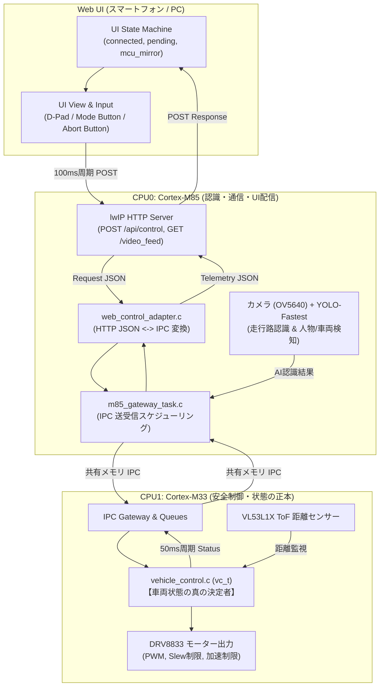
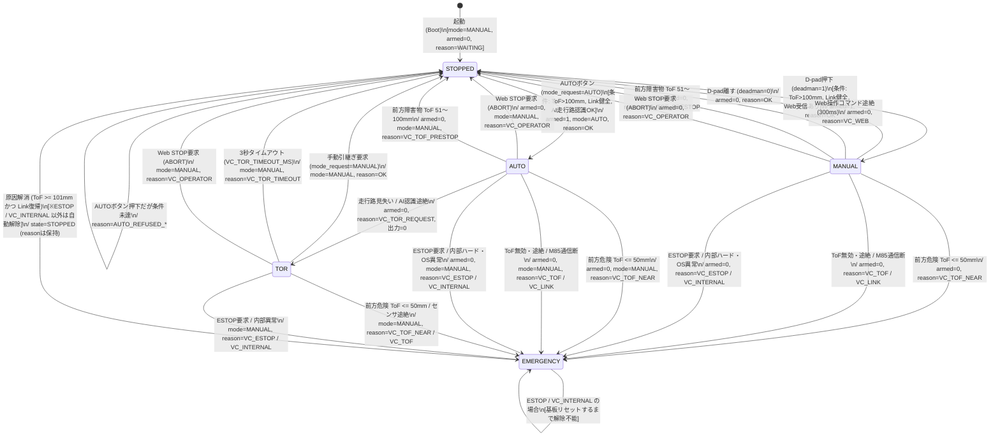
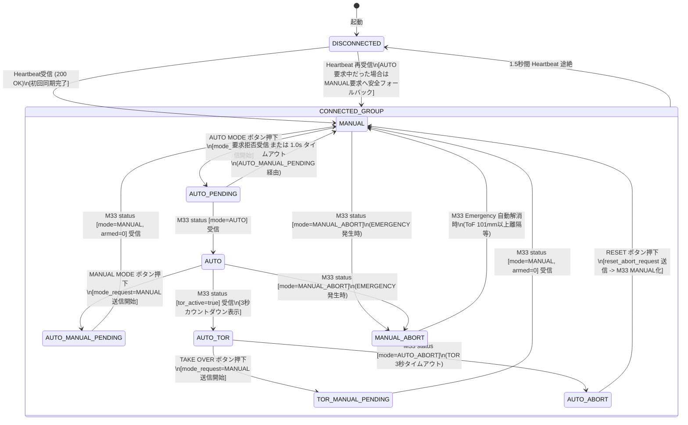
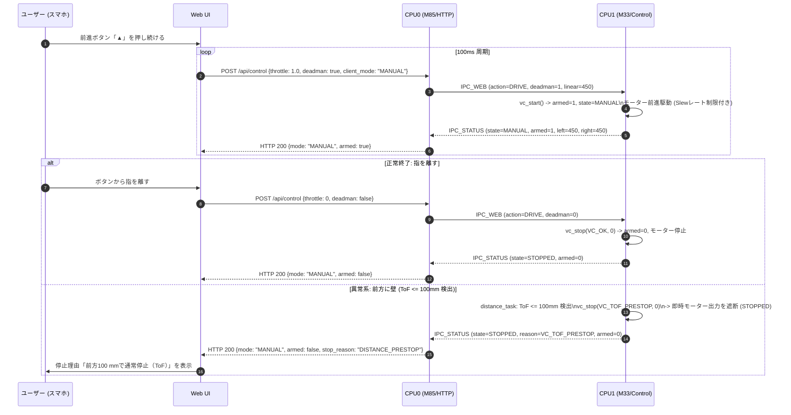
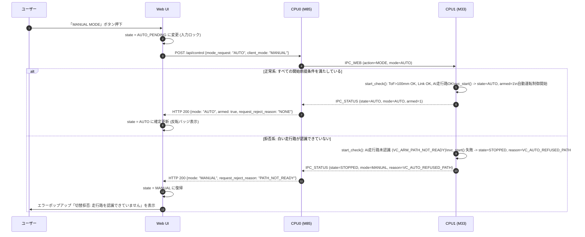

# マイコン（MCU）および Web UI 状態遷移仕様書 & 解析レポート

本ドキュメントは、車載マイコン（CPU1: Cortex-M33 / CPU0: Cortex-M85）および Web UI（ブラウザ側 WebApp）のソースコードを解析し、状態遷移モデルを Mermaid 図として整理したものです。また、コード解析により判明したバグおよび仕様との不整合について詳述します。

---

## 1. システム全体アーキテクチャと状態管理の分担



- **車両状態の決定権（正本）**: すべて **CPU1（Cortex-M33）** にあります。
- **Web UI の役割**: 操作要求（`mode_request`, `throttle`, `steering`, `deadman`, `manual_abort_request`, `reset_abort_request`）を送り、M33 から返ってくる確定状態（`mode`, `armed`, `tor_active`, `stop_reason` 等）を画面に反映（ミラーリング）します。

---

## 2. マイコン（CPU1: Cortex-M33）状態遷移図

マイコン（`vehicle_control.c`）内部の変数 `vc_status_t.state`、`mode`、`reason`、`armed` に基づく状態遷移です。



### マイコン状態遷移の重要ルール
1. **停止時は自動再発進しない**: いかなる理由で停止（`STOPPED` / `EMERGENCY`）した場合も、停止原因が解消しただけで自動的に `MANUAL` や `AUTO` に再発進することはなく、必ず人間の明示的操作（パッド押下またはAUTOボタン）が必要です。
2. **TOR 中の出力ゼロ**: TOR（運転引継ぎ要求）に入った瞬間、モーター出力は直ちに 0 となり、走行路上で安全に減速・停止して人間の介入を待ちます。
3. **AUTO はスマートフォンの切断を監視しない**: MANUAL は 300ms コマンドが途絶えるとフェイルセーフ停止しますが、AUTO はカメラAIと ToF センサーのみに依存して走行するため、スマホの Wi-Fi が切れても自律走行を継続します。

---

## 3. Web UI 状態遷移図

Web UI（`state-machine.js`）は、「HTTP通信接続状態（`connected`）」「未完了のユーザー操作（`pending`）」「M33から受信したテレメトリ（`mcu`）」の3要素から画面状態（`UIState`）を導出します。



### Web UI 状態（`UIState`）一覧表
| 状態名 | 操作入力 (D-pad) | モードボタン表示 | 停止ボタン表示 | 画面表示・警告 |
|---|---|---|---|---|
| `DISCONNECTED` | 無効 (ロック) | ロック | ロック | 「未接続」オーバーレイ |
| `MANUAL` | **有効 (前進・旋回)** | `MANUAL MODE` (押すとAUTO要求) | `ABORT` | 通常画面 (カメラ映像, 距離HUD) |
| `AUTO_PENDING` | 無効 (ロック) | `AUTO MODE` (点滅) | `ABORT` | AUTO要求中 (1秒タイムアウト監視) |
| `AUTO` | 無効 (ロック) | `AUTO MODE` (反転/押すとMANUAL要求) | `ABORT` | 自動運転中表示 (反転バッジ) |
| `AUTO_MANUAL_PENDING` | 無効 (ロック) | `MANUAL MODE` (点滅) | `ABORT` | 手動復帰要求中 (再送ループ) |
| `AUTO_TOR` | 無効 (引継ぎ優先) | ロック | `ABORT` | **TOR警告枠点滅、3秒カウントダウン、TAKE OVERボタン** |
| `TOR_MANUAL_PENDING` | 無効 (ロック) | ロック | `ABORT` | TAKE OVER要求中 (再送ループ) |
| `AUTO_ABORT` | 無効 (ロック) | ロック | **`RESET`** | 中断理由表示 (引継ぎ時間切れ等) |
| `MANUAL_ABORT` | 無効 (ロック) | ロック | **`RESET`** | 中断理由表示 (緊急停止理由等) |

---

## 4. マイコンと Web UI の協調シーケンス

### シーケンス 1: MANUAL 走行と デッドマン / 障害物停止



---

### シーケンス 2: AUTO モード切替と拒否判定



---

### シーケンス 3: 人物・車両検知のアラームとログ

```mermaid
sequenceDiagram
    autonumber
    participant U as ユーザー
    participant W as Web UI
    participant M85 as CPU0 (カメラAI)
    participant M33 as CPU1 (安全制御)

    Note over M85, M33: 車両は AUTO モードで自動走行中

    M85->>M85: YOLO-Fastest が進路上に人物検知 (信頼度 0.85)\n走行は停止せずアラームワード更新
    M85-->>W: HTTP 200 {obstacle_alarm: true, obstacle_kind: "PERSON", alarm_seq: 1}
    W->>U: 画面上部「⚠ 人物を検知」表示 & 左上ログ追加 (走行継続)

    Note over M85,M33: 障害物検知はモード変更要求に使わない
    M85-->>W: HTTP 200 {obstacle_alarm: true, obstacle_kind: "PERSON", alarm_seq: 1}
    W->>U: 画面上部のバッジとログで通知
    M33->>M33: 有効な走行路があればAUTOとモーター出力を維持
    U->>W: 必要と判断した場合にMANUALへ切替
    W->>M85: POST /api/control {mode_request: "MANUAL"}
    M85->>M33: IPC_WEB (operator mode request)
    M33->>M33: STOPPED / MANUALへ切替

    Note over M33: ToFの100 mm停止・50 mm緊急停止は障害物ログと独立して優先
    end
```

---

## 5. コード解析により発見されたバグ・設計不整合一覧

コード（C言語およびJavaScript）の網羅的解析により、**5件の不具合・潜在的リスク**を発見しました。

### 【バグ 1: 重大】手動 ABORT ボタン押下時に `MANUAL_ABORT` 画面にならず即座に `MANUAL`（走行可能）に復帰してしまう
- **該当箇所**: `CPU0/src/web_control_adapter.c` (`response_mode` 関数 74〜94行目)
- **問題の内容**:
  `README.md`（デモシナリオ 7:「`ABORT` で即時停止し、`RESET` を押すまで再発進しないことを確認する」）、`docs/protocol.md`（「`manual_abort_request: true`: 最優先で全出力を遮断し `MANUAL_ABORT`」）、`docs/ui-spec.md`（全体状態遷移図）では、画面の ABORT ボタンを押すと手動中断状態（`MANUAL_ABORT`）に遷移し、入力がロックされ、停止ボタンが「RESET」に変わり、RESETを押すまで再発進できない仕様とされています。
  しかし、`web_control_adapter.c` の実装は以下のようになっています：
  ```c
  static vehicle_state_t response_mode(const vc_status_t *status)
  {
      switch (status->state) {
      case VC_EMERGENCY:
          return VEHICLE_MANUAL_ABORT;
      case VC_AUTO:
      case VC_TOR:
          return VEHICLE_AUTO;
      case VC_MANUAL:
          return VEHICLE_MANUAL;
      default:
          /* status->state == VC_STOPPED の場合 */
          if (status->reason == VC_TOR_TIMEOUT) return VEHICLE_AUTO_ABORT;
          return (status->mode == VC_MODE_AUTO) ? VEHICLE_AUTO : VEHICLE_MANUAL;
      }
  }
  ```
  手動 ABORT を押したとき、M33 は `vc_stop(v, VC_OPERATOR, 0)` により `state = VC_STOPPED`（`reason = VC_OPERATOR`）となります。
  上記 `response_mode` では、`VC_STOPPED` かつ `reason == VC_OPERATOR` の場合、**`VEHICLE_MANUAL`** が返されます。
  その結果、Web UI（`state-machine.js`）は直ちに `pending` を解除して **`UIState.MANUAL`（走行可能状態）に復帰** してしまいます。
- **影響**:
  - 画面の停止ボタンが「RESET」にならず「ABORT」のまま残る。
  - 操作パッドのロックが即座に解除され、RESETボタンを押さなくてもすぐに再発進できてしまう。
  - **審査員デモ手順（README.md デモシナリオ7）および安全仕様書と明確に矛盾している。**
- **背景と根本原因**:
  M33 側には元々「RESET」専用コマンドがなく、Web側の `reset_abort_request` も `manual_abort_request` と同じ `VC_WEB_STOP`（`VC_OPERATOR`）にマッピングされています。そのため、もし `reason == VC_OPERATOR` で `MANUAL_ABORT` を返すと、今度は RESET を押しても M33 の reason が解除されず `MANUAL_ABORT` から永久に抜け出せなくなるため、暫定修正として `VEHICLE_MANUAL` を返してしまった痕跡が見られます。M33 にリセット処理（reason を `VC_OK` に戻す）を導入するか、M85 で手動ABORTのラッチ状態を管理する必要があります。

---

### 【バグ 2: 重大】EMERGENCY 中に内部異常（`VC_INTERNAL`）が発生した場合に上書きされず、ToF 離隔で誤解除される
- **該当箇所**: `control/src/vehicle_control.c` (`vc_stop` 関数 92〜103行目)
- **問題の内容**:
  ```c
  void vc_stop(vc_t *v, uint32_t why, int emergency)
  {
      /* An explicit ESTOP always upgrades an earlier sensor/AI emergency.
       * Lesser stop causes never downgrade an existing emergency. */
      if (v->status.state == VC_EMERGENCY && why != VC_ESTOP) return;
      ...
  }
  ```
  すでに `v->status.state == VC_EMERGENCY`（例えば壁に近づきすぎて `VC_TOF_NEAR` になっている状態）のときに、ハードウェア故障やカーネルの重大な内部障害が発生して `stop_locked(VC_INTERNAL, 1)` が呼ばれた場合、`why != VC_ESTOP` であるため `vc_stop` は直ちに return し、理由（`v->status.reason`）は `VC_TOF_NEAR` のまま更新されません。
  この状態で車体を壁から離すと、`vc_step()` の自動解除処理：
  ```c
  if (v->status.state == VC_EMERGENCY &&
      v->status.reason != VC_INTERNAL && v->status.reason != VC_ESTOP && ...)
      (void)vc_clear_emergency(v, now);
  ```
  において、`v->status.reason` が `VC_TOF_NEAR` のままであるため、内部異常が発生しているにもかかわらず `clear_check()` をパスし、**EMERGENCY が勝手に自動解除されて `VC_STOPPED` に戻ってしまいます。**
- **影響**:
  基板リセットが必要なハードウェア/OS障害（`VC_INTERNAL`）が隠蔽され、再発進可能な状態に遷移してしまう安全上のリスク（フェイルセーフ原則の違反）。
- **対策**:
  `if (v->status.state == VC_EMERGENCY && why != VC_ESTOP && why != VC_INTERNAL) return;` のように、`VC_INTERNAL` も最優先の上書き対象として扱う必要があります。

---

### 【バグ 3: 中程度】AUTO 走行中の通信切断時の挙動における仕様書と実装の乖離
- **該当箇所**: `control/src/vehicle_control.c` (363行目) および `M85Web/Application/mini-4wd-webapp/docs/protocol.md` (134行目)
- **問題の内容**:
  - `docs/protocol.md` 134行目には「通信切断判定 1,500 ms: テレメトリ途絶で DISCONNECTED 遷移、**マイコンは AUTO_ABORT**」と記載されています。
  - しかし実際の M33 実装では、363行目のコメント `/* AUTO ignores the phone */` の通り、AUTO走行中は Web（スマートフォン）からの通信途絶を意図的に監視していません（AIカメラとToFのみで自律走行を続けます）。
  - そのため、AUTO走行中にスマホのブラウザを閉じたりWi-Fiを切断しても、マイコンは `AUTO_ABORT` にならず走行を続けます（README.md 113行目の説明とは一致していますが、通信プロトコル仕様書とは矛盾しています）。
  - さらに、切断後にスマホが再接続した際、UI側（`state-machine.js` 181行目）は AUTO要求中だった場合に自動的に `Cmd.MANUAL` を保留にするため、再接続した瞬間に手動復帰コマンドが飛んで車両が停止する挙動となります。

---

### 【バグ 4: 軽微】TOR 残り時間カウントダウンの同期ズレ
- **該当箇所**: `CPU0/src/web_control_adapter.c` (`web_adapter_tor_remaining_ms` 関数 149〜162行目)
- **問題の内容**:
  M33 内部では `(now - v->tor_ms) >= 3000ms` でタイムアウト判定を行います。しかし `tor_remaining_ms` は M33 のステータス構造体には含まれておらず、M85 側の `g_tor_tracker` が「M85 が初めて TOR を受信した時刻」を起点に計算しています。
  M33 から M85 へのステータス通信周期が 50ms であるため、M85 側のタイマー起点は最大 50ms 遅れます。そのため、Web 画面上のカウントダウンがまだ `0.1s` 程度残っている表示の段階で、M33 側が先に 3000ms タイムアウトして停止・画面遷移する現象が発生します。
- **対策**:
  M33 内部の残り時間を `vc_status_t` に含めて M85 に渡すのが理想的です。

---

### 【バグ 5: 軽微】`vc_step()` 内の旧 `VC_AI_OBSTACLE` チェックのデッドコード
- **該当箇所**: `control/src/vehicle_control.c` (345行目)
- **問題の内容**:
  ```c
  if (v->status.state == VC_EMERGENCY &&
      v->status.reason != VC_INTERNAL && v->status.reason != VC_ESTOP &&
      (v->status.reason != VC_AI_OBSTACLE || p.motor_enable))
      (void)vc_clear_emergency(v, now);
  ```
  2026-09-28 の改修により、AIによる障害物検知は EMERGENCY ではなく TOR（`VC_TOR_OBSTACLE`）に変更されました（`vehicle_control.h` にも `VC_AI_OBSTACLE, /* no longer produced */` と明記）。
  したがって、`v->status.state == VC_EMERGENCY` かつ `reason == VC_AI_OBSTACLE` になることは決してなく、この条件式は不要な残骸となっています。
